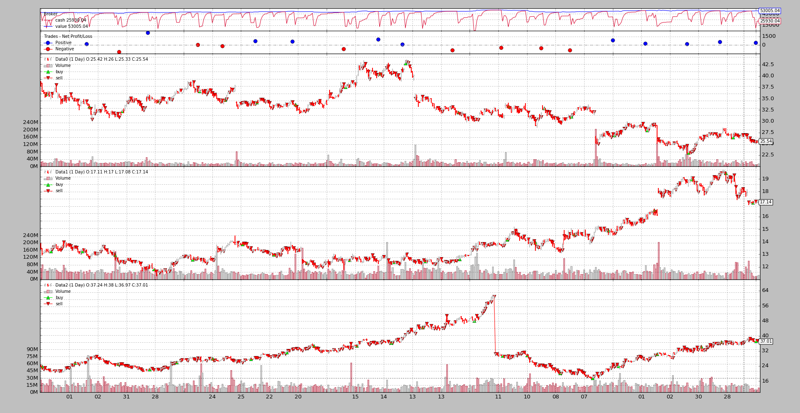
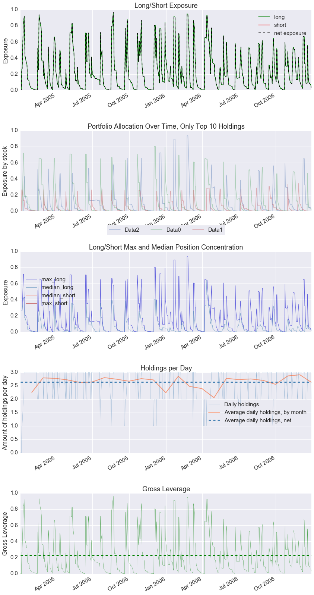

- [Pyfolio Integration](#pyfolio-integration)
  - [No PyFolio](#no-pyfolio)
  - [A PyFolio run](#a-pyfolio-run)

------------------------------------------------------
# Pyfolio Integration
一个整合的投资组合工具，即pyfolio，源自[Ticket＃108](https://github.com/mementum/backtrader/issues/108)。

鉴于zipline和之间的紧密集成，第一眼看教程觉得很难，但是pyfolio的测试数据实际上对于解码幕后运行的内容非常有用。

大部分代码已经在backtrader中就位了：

* Analyzer 基础设施
* Children analyzer
* 一个 TimeReturn analyzer

仅需要一个主 `PyFolio` 分析仪 和 3个简易子分析仪。此外，依赖于一个 pyfolio的pandas方法。

最具挑战性的部分……“正确处理所有依赖项”。

* 更新 pandas
* 更新 numpy
* 更新 scikit-lean
* 更新 seaborn

在具有C编译器的类Unix环境下，只是时间问题。在Windows下，甚至安装了特定的Microsoft编译器（在本例中为Python 2.7的链），都失败了。但是，一个知名站点收集了Windows的最新软件包，对此有所帮助。如果需要，请访问它：

* http://www.lfd.uci.edu/~gohlke/pythonlibs/

如果不进行测试，集成将无法完成，这就是为什么通常的样例一如既往地存在。

## No PyFolio
测试用例使用 `random.randint` 来决定何时 buy/sell, 所以这是一个检测工作正常的简单手段

```
$ ./pyfoliotest.py --printout --no-pyfolio --plot
```

输出:
```
Len,Datetime,Open,High,Low,Close,Volume,OpenInterest
0001,2005-01-03T23:59:59,38.36,38.90,37.65,38.18,25482800.00,0.00
BUY  1000 @%23.58
0002,2005-01-04T23:59:59,38.45,38.54,36.46,36.58,26625300.00,0.00
BUY  1000 @%36.58
SELL 500 @%22.47
0003,2005-01-05T23:59:59,36.69,36.98,36.06,36.13,18469100.00,0.00
...
SELL 500 @%37.51
0502,2006-12-28T23:59:59,25.62,25.72,25.30,25.36,11908400.00,0.00
0503,2006-12-29T23:59:59,25.42,25.82,25.33,25.54,16297800.00,0.00
SELL 250 @%17.14
SELL 250 @%37.01
```

3组datas 和 一些 buy/sell 操作被随机选取, 分散在2年的test过程中

## A PyFolio run
`pyfolio` 在 Jupyter Notebook 内工作正常
> `runstrat` gets here [] as argument to run with default arguments and skip arguments passed by the notebook itself

```
%matplotlib inline
```
```
from __future__ import (absolute_import, division, print_function,
                        unicode_literals)


import argparse
import datetime
import random

import backtrader as bt


class St(bt.Strategy):
    params = (
        ('printout', False),
        ('stake', 1000),
    )

    def __init__(self):
        pass

    def start(self):
        if self.p.printout:
            txtfields = list()
            txtfields.append('Len')
            txtfields.append('Datetime')
            txtfields.append('Open')
            txtfields.append('High')
            txtfields.append('Low')
            txtfields.append('Close')
            txtfields.append('Volume')
            txtfields.append('OpenInterest')
            print(','.join(txtfields))

    def next(self):
        if self.p.printout:
            # Print only 1st data ... is just a check that things are running
            txtfields = list()
            txtfields.append('%04d' % len(self))
            txtfields.append(self.data.datetime.datetime(0).isoformat())
            txtfields.append('%.2f' % self.data0.open[0])
            txtfields.append('%.2f' % self.data0.high[0])
            txtfields.append('%.2f' % self.data0.low[0])
            txtfields.append('%.2f' % self.data0.close[0])
            txtfields.append('%.2f' % self.data0.volume[0])
            txtfields.append('%.2f' % self.data0.openinterest[0])
            print(','.join(txtfields))

        # Data 0
        for data in self.datas:
            toss = random.randint(1, 10)
            curpos = self.getposition(data)
            if curpos.size:
                if toss > 5:
                    size = curpos.size // 2
                    self.sell(data=data, size=size)
                    if self.p.printout:
                        print('SELL {} @%{}'.format(size, data.close[0]))

            elif toss < 5:
                self.buy(data=data, size=self.p.stake)
                if self.p.printout:
                    print('BUY  {} @%{}'.format(self.p.stake, data.close[0]))


def runstrat(args=None):
    args = parse_args(args)

    cerebro = bt.Cerebro()
    cerebro.broker.set_cash(args.cash)

    dkwargs = dict()
    if args.fromdate:
        fromdate = datetime.datetime.strptime(args.fromdate, '%Y-%m-%d')
        dkwargs['fromdate'] = fromdate

    if args.todate:
        todate = datetime.datetime.strptime(args.todate, '%Y-%m-%d')
        dkwargs['todate'] = todate

    data0 = bt.feeds.BacktraderCSVData(dataname=args.data0, **dkwargs)
    cerebro.adddata(data0, name='Data0')

    data1 = bt.feeds.BacktraderCSVData(dataname=args.data1, **dkwargs)
    cerebro.adddata(data1, name='Data1')

    data2 = bt.feeds.BacktraderCSVData(dataname=args.data2, **dkwargs)
    cerebro.adddata(data2, name='Data2')

    cerebro.addstrategy(St, printout=args.printout)
    if not args.no_pyfolio:
        cerebro.addanalyzer(bt.analyzers.PyFolio, _name='pyfolio')

    results = cerebro.run()
    if not args.no_pyfolio:
        strat = results[0]
        pyfoliozer = strat.analyzers.getbyname('pyfolio')

        returns, positions, transactions, gross_lev = pyfoliozer.get_pf_items()
        if args.printout:
            print('-- RETURNS')
            print(returns)
            print('-- POSITIONS')
            print(positions)
            print('-- TRANSACTIONS')
            print(transactions)
            print('-- GROSS LEVERAGE')
            print(gross_lev)

        import pyfolio as pf
        pf.create_full_tear_sheet(
            returns,
            positions=positions,
            transactions=transactions,
            gross_lev=gross_lev,
            live_start_date='2005-05-01',
            round_trips=True)

    if args.plot:
        cerebro.plot(style=args.plot_style)


def parse_args(args=None):

    parser = argparse.ArgumentParser(
        formatter_class=argparse.ArgumentDefaultsHelpFormatter,
        description='Sample for pivot point and cross plotting')

    parser.add_argument('--data0', required=False,
                        default='../../datas/yhoo-1996-2015.txt',
                        help='Data to be read in')

    parser.add_argument('--data1', required=False,
                        default='../../datas/orcl-1995-2014.txt',
                        help='Data to be read in')

    parser.add_argument('--data2', required=False,
                        default='../../datas/nvda-1999-2014.txt',
                        help='Data to be read in')

    parser.add_argument('--fromdate', required=False,
                        default='2005-01-01',
                        help='Starting date in YYYY-MM-DD format')

    parser.add_argument('--todate', required=False,
                        default='2006-12-31',
                        help='Ending date in YYYY-MM-DD format')

    parser.add_argument('--printout', required=False, action='store_true',
                        help=('Print data lines'))

    parser.add_argument('--cash', required=False, action='store',
                        type=float, default=50000,
                        help=('Cash to start with'))

    parser.add_argument('--plot', required=False, action='store_true',
                        help=('Plot the result'))

    parser.add_argument('--plot-style', required=False, action='store',
                        default='bar', choices=['bar', 'candle', 'line'],
                        help=('Plot style'))

    parser.add_argument('--no-pyfolio', required=False, action='store_true',
                        help=('Do not do pyfolio things'))

    import sys
    aargs = args if args is not None else sys.argv[1:]
    return parser.parse_args(aargs)
```

```
runstrat([])
```

```
Entire data start date: 2005-01-03
Entire data end date: 2006-12-29


Out-of-Sample Months: 20
Backtest Months: 3
```

```
[-0.012 -0.025]
```





测试用例脚本如下:
```
$ ./pyfoliotest.py --help
usage: pyfoliotest.py [-h] [--data0 DATA0] [--data1 DATA1] [--data2 DATA2]
                      [--fromdate FROMDATE] [--todate TODATE] [--printout]
                      [--cash CASH] [--plot] [--plot-style {bar,candle,line}]
                      [--no-pyfolio]

Sample for pivot point and cross plotting

optional arguments:
  -h, --help            show this help message and exit
  --data0 DATA0         Data to be read in (default:
                        ../../datas/yhoo-1996-2015.txt)
  --data1 DATA1         Data to be read in (default:
                        ../../datas/orcl-1995-2014.txt)
  --data2 DATA2         Data to be read in (default:
                        ../../datas/nvda-1999-2014.txt)
  --fromdate FROMDATE   Starting date in YYYY-MM-DD format (default:
                        2005-01-01)
  --todate TODATE       Ending date in YYYY-MM-DD format (default: 2006-12-31)
  --printout            Print data lines (default: False)
  --cash CASH           Cash to start with (default: 50000)
  --plot                Plot the result (default: False)
  --plot-style {bar,candle,line}
                        Plot style (default: bar)
  --no-pyfolio          Do not do pyfolio things (default: False)
```