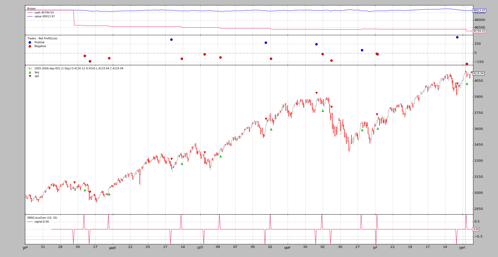

- [Slippage](#slippage)
  - [How it works](#how-it-works)
  - [Configuring slippage](#configuring-slippage)
  - [Practical examples](#practical-examples)

---------------------------------------------------------
# Slippage

回测系统不能保证真实的市场状况。无论市场模拟有多好，在真实的市场条件下，都可能出现下滑。这意味着：

* 请求的价格可能不匹配

集成回测 broker 支持滑点。可以将以下参数传递给 broker:

* `slip_perc` (default: 0.0)    
    绝对条件下的百分比（和正值），用于向上/向下滑点买入/卖出订单的价格
    > 0.01 = 1%
    >
    > 0.001 = 0.1%

* `slip_fixed` (default: 0.0)   
    单位百分比（正数），用于向上/向下滑动买入/卖出订单的价格
    > 注：如果 `slip_perc` 不为零，则它会优先于`slip_fixed`。

* `slip_open` (default: `False`)    
    是否为订单执行滑点价格，它将专门使用下一个 bar 的开盘价。一个例子是市价订单，它是用下一个可用的 tick 来执行的，即：bar的开盘价。

    这也适用于其他一些执行，因为当移动到一个新的 bar 时，逻辑将尝试检测开盘价格是否与请求的价格/执行类型匹配。

* `slip_match` (default: `True`)    
    如果为 `True` ，broker 将提供一个匹配的上下限，在高/低价格上，以防超过他们。

    如果为 `False`，broker 将不匹配订单与当前价格，并将在下一次迭代中尝试执行


* `slip_limit` (default: `True`)    
    即使 `slip_match` 为 `False`，也将匹配所请求的精确匹配价格的限价订单。

    此选项控制该行为:
    * 如果为 `True` ，则限价订单将通过 limit/high/low 价格来匹配

    * 如果为 `False` 同时滑点超过上限，那么将没有匹配

* `slip_out` (default: `False`)     
    即使价格跌到 (high - low) 范围之外，也要提供滑动。

## How it works

为了决定何时应用滑移，需要考虑订单执行类型：

* `Close` - 不使用滑点  
    此订单与收盘价相匹配，此价格为当天最后一个价格。滑点是不可能发生的，因为订单只能在交易的最后一刻发生，而且这是一个没有任何容差的独特价格。

* `Market` - 应用滑点   
    请检查 slip_open 异常, 因为 Market order 将在下个bar的开盘价匹配

* `Limit` - 滑点应用于以下逻辑:
    * 如果匹配价格是开盘价, 滑点根据参数 `slip_open` 使用. 如果使用滑点, 价格将永远不会比要求的 `limit` 价格更糟
    
    * 如果匹配价格不是 `limit` 价格, 则在 high/low 采用滑点。在这种情况下，`slip_limit` 应用于决定在超过上限的情况下是否会发生匹配

    * 如果匹配价格是 `limit` 价格, 不使用滑点

* `Stop` - 一旦订单被触发，同样的逻辑也适用于市价订单

* `StopLimit` - 一旦订单被触发，适用的逻辑与 Limit 订单相同

该方法试图在模拟和可用数据的限制范围内提供最真实的可能的方法

## Configuring slippage

由 cerebro 引擎实例化的 broker 每次使用默认参数运行。有两种方法可以改变这种行为:

* 使用方法配置滑点
    ```
    BackBroker.set_slippage_perc(perc, slip_open=True, slip_limit=True, slip_match=True, slip_out=False)
    ```
    配置滑点基于百分比

    ```
    BackBroker.set_slippage_fixed(fixed, slip_open=True, slip_limit=True, slip_match=True, slip_out=False)
    ```
    配置滑点基于固定点

* 替换 broker:
    ```
    import backtrader as bt

    cerebro = bt.Cerebro()
    cerebro.broker = bt.brokers.BackBroker(slip_perc=0.005)  # 0.5%
    ```

## Practical examples
资料来源包含一个使用指令执行类型为 Market 和 使用信号的 long/short 方法的例子, 可以用来理解其逻辑。

无滑点运行和初始化图供参考:
```
$ ./slippage.py --plot
01 2005-03-22 23:59:59 SELL Size: -1 / Price: 3040.55
02 2005-04-11 23:59:59 BUY  Size: +1 / Price: 3088.47
03 2005-04-11 23:59:59 BUY  Size: +1 / Price: 3088.47
04 2005-04-19 23:59:59 SELL Size: -1 / Price: 2948.38
05 2005-04-19 23:59:59 SELL Size: -1 / Price: 2948.38
06 2005-05-19 23:59:59 BUY  Size: +1 / Price: 3034.88
...
35 2006-12-19 23:59:59 BUY  Size: +1 / Price: 4121.01
```



同样的例子, 使用 1.5% 滑点
```
$ ./slippage.py --slip_perc 0.015
01 2005-03-22 23:59:59 SELL Size: -1 / Price: 3040.55
02 2005-04-11 23:59:59 BUY  Size: +1 / Price: 3088.47
03 2005-04-11 23:59:59 BUY  Size: +1 / Price: 3088.47
04 2005-04-19 23:59:59 SELL Size: -1 / Price: 2948.38
05 2005-04-19 23:59:59 SELL Size: -1 / Price: 2948.38
06 2005-05-19 23:59:59 BUY  Size: +1 / Price: 3034.88
...
35 2006-12-19 23:59:59 BUY  Size: +1 / Price: 4121.01
```
没有变化, 这是该场景预期的行为
* 执行类型: `Market`
* `slip_open` 没被设置为 `True`     
    Market orders 与下一个 Bar 的开盘价相匹配，我们不允许开盘价被移动。

设置 `slip_open` 为 `True`:
```
$ ./slippage.py --slip_perc 0.015 --slip_open
01 2005-03-22 23:59:59 SELL Size: -1 / Price: 3021.66
02 2005-04-11 23:59:59 BUY  Size: +1 / Price: 3088.47
03 2005-04-11 23:59:59 BUY  Size: +1 / Price: 3088.47
04 2005-04-19 23:59:59 SELL Size: -1 / Price: 2948.38
05 2005-04-19 23:59:59 SELL Size: -1 / Price: 2948.38
06 2005-05-19 23:59:59 BUY  Size: +1 / Price: 3055.14
...
35 2006-12-19 23:59:59 BUY  Size: +1 / Price: 4121.01
```
可以立即看到价格已经发生了变化。分配的价格是最坏的或者相等(比如操作35)。这不是复制粘贴错误

* open 和 high 在 2006-12-19 是一样的   
    价格不能被推高，因为那将意味着返回一个不存在的价格。

当然，backtrader 允许匹配超出的 (high - low) 的范围，如果使用 `slip_out`。一个运行的例子:
```
$ ./slippage.py --slip_perc 0.015 --slip_open --slip_out
01 2005-03-22 23:59:59 SELL Size: -1 / Price: 2994.94
02 2005-04-11 23:59:59 BUY  Size: +1 / Price: 3134.80
03 2005-04-11 23:59:59 BUY  Size: +1 / Price: 3134.80
04 2005-04-19 23:59:59 SELL Size: -1 / Price: 2904.15
05 2005-04-19 23:59:59 SELL Size: -1 / Price: 2904.15
06 2005-05-19 23:59:59 BUY  Size: +1 / Price: 3080.40
...
35 2006-12-19 23:59:59 BUY  Size: +1 / Price: 4182.83
```
匹配价格的匹配表达式是:OMG!(哦我的上帝!)。价格显然超出了我们的范围。只需看看操作35，它被匹配到4182.83。快速查看一下这份文件中的图表就会发现，该资产从未接近过这个价格。

`slip_match` 的默认值为 `True`，这意味着 backtrader 提供一个匹配，无论是有上限的还是无上限的价格，如上所示。让我们禁用它:
```
$ ./slippage.py --slip_perc 0.015 --slip_open --no-slip_match
01 2005-04-15 23:59:59 SELL Size: -1 / Price: 3028.10
02 2005-05-18 23:59:59 BUY  Size: +1 / Price: 3029.40
03 2005-06-01 23:59:59 BUY  Size: +1 / Price: 3124.03
04 2005-10-06 23:59:59 SELL Size: -1 / Price: 3365.57
05 2005-10-06 23:59:59 SELL Size: -1 / Price: 3365.57
06 2005-12-01 23:59:59 BUY  Size: +1 / Price: 3499.95
07 2005-12-01 23:59:59 BUY  Size: +1 / Price: 3499.95
08 2006-02-28 23:59:59 SELL Size: -1 / Price: 3782.71
09 2006-02-28 23:59:59 SELL Size: -1 / Price: 3782.71
10 2006-05-23 23:59:59 BUY  Size: +1 / Price: 3594.68
11 2006-05-23 23:59:59 BUY  Size: +1 / Price: 3594.68
12 2006-11-27 23:59:59 SELL Size: -1 / Price: 3984.37
13 2006-11-27 23:59:59 SELL Size: -1 / Price: 3984.37
```

从35降到13, 原因如下:

如果滑点会将匹配价格推到 高于或低于 bar 的 high/low 价，则禁用 `slip_match` 将不允许匹配操作。在 1.5% 的请求滑点中，似乎有22个操作没有执行。

示例应该展示了不同的滑点选项是如何一起工作的