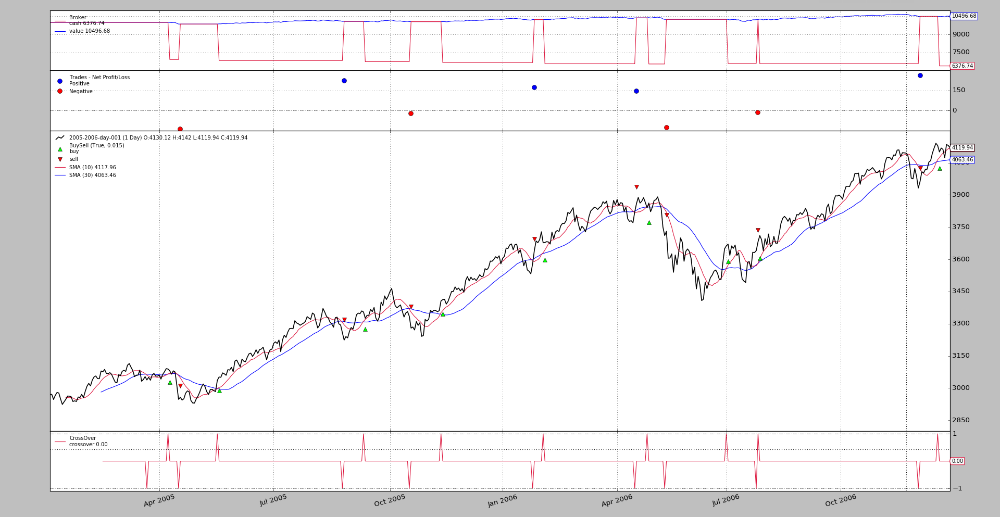

- [Cheat On Open](#cheat-on-open)
  - [Trying cheat-on-open](#trying-cheat-on-open)
  - [Conclusion](#conclusion)
  - [Sample usage](#sample-usage)
  - [Sample source](#sample-source)

---------------------------------------------
# Cheat On Open
版本1.9.44.116增加了对 `Cheat-On-Open` 的支持。这似乎是那些全力以赴的人所需要的功能，他们在 bar 结束后做了计算，但期望与 open 价格相匹配。

这样的用例在开盘价差价(上涨或下跌，取决于买卖是否有效)和现金不足以进行全部操作时就失败了。这将迫使 broker 拒绝操作

尽管人们可以尝试使用正的索引[1]方法来窥探未来，但这需要预先加载数据，而这些数据并不总是可用的。

模式:
```
cerebro = bt.Cerebro(cheat_on_open=True)
```
* 在系统中激活一个额外的循环，该循环调用策略中的方法 `next_open` , `nextstart_open` 和 `prenext_open`

    决定增加一系列方法是为了明确区分常规方法和作弊模式下的操作方法，这些方法是基于被检查的价格不再可用且未来未知。

    这也避免了对常规next方法的两次调用。

在xxx_open方法中，以下情况适用：

* 这些指标尚未重新计算，并保留了上一个周期中采用等效xxx常规方法最后看到的数值(使用的是上一个周期的指标)

* broker 尚未评估新周期的待订单(pending orders)，可以引入新订单，如果可能，将对其进行评估

注意:
* `Cerebro` 也有一个 `broker_coo（默认值：True）`参数，它告诉 cerebro，如果“ `cheat-on-open` ” 被激活，它也应尽可能在 broker 中激活它。

模拟 broker 有一个名为：`coo` 的参数和一个设置它的方法 `set_coo`
## Trying cheat-on-open

下面的示例有两种不同行为的策略：
* 如果 `cheat-on-open` 为 `True`，它将只操作`next_open`
* 如果 `cheat-on-open` 为 `False`，它将只操作 `next`

在这两种情况下，匹配价格必须相同:
* 如果不作弊，订单将在前一天结束时发出，并将与下一个进入价格匹配，即开盘价。

* 如果作弊，命令在执行当天发出。因为订单是在经纪人评估订单之前发出的，它还将与下一个入市价格，即开盘价相匹配。  
    第二种情况下，可以计算所有策略的确切风险，因为可以直接获得当前的开盘价。

在两种情况下:
* 当前的开盘价和收盘价将从 `next` 打印出来。

**常规执行**:
```
$ ./cheat-on-open.py --cerebro cheat_on_open=False

...
2005-04-07 next, open 3073.4 close 3090.72
2005-04-08 next, open 3092.07 close 3088.92
Strat Len 68 2005-04-08 Send Buy, fromopen False, close 3088.92
2005-04-11 Buy Executed at price 3088.47
2005-04-11 next, open 3088.47 close 3080.6
2005-04-12 next, open 3080.42 close 3065.18
...
```


该订单:
* 在2005-04-08收盘之后发出定单
* 执行在2005-04-11的开盘价3088.47

**作弊执行**
```
$ ./cheat-on-open.py --cerebro cheat_on_open=True

...
2005-04-07 next, open 3073.4 close 3090.72
2005-04-08 next, open 3092.07 close 3088.92
2005-04-11 Send Buy, fromopen True, close 3080.6
2005-04-11 Buy Executed at price 3088.47
2005-04-11 next, open 3088.47 close 3080.6
2005-04-12 next, open 3080.42 close 3065.18
...
```


该订单:
* 在4月11日之前发出定单
* 执行在4月11日的开盘价

图上的结果也是一样的

## Conclusion
在开盘价上作弊允许在 open 之前发布 order，这可以允许在所有场景中精确计算购买股数。

## Sample usage
```
$ ./cheat-on-open.py --help
usage: cheat-on-open.py [-h] [--data0 DATA0] [--fromdate FROMDATE]
                        [--todate TODATE] [--cerebro kwargs] [--broker kwargs]
                        [--sizer kwargs] [--strat kwargs] [--plot [kwargs]]

Cheat-On-Open Sample

optional arguments:
  -h, --help           show this help message and exit
  --data0 DATA0        Data to read in (default:
                       ../../datas/2005-2006-day-001.txt)
  --fromdate FROMDATE  Date[time] in YYYY-MM-DD[THH:MM:SS] format (default: )
  --todate TODATE      Date[time] in YYYY-MM-DD[THH:MM:SS] format (default: )
  --cerebro kwargs     kwargs in key=value format (default: )
  --broker kwargs      kwargs in key=value format (default: )
  --sizer kwargs       kwargs in key=value format (default: )
  --strat kwargs       kwargs in key=value format (default: )
  --plot [kwargs]      kwargs in key=value format (default: )
```

## Sample source
```
from __future__ import (absolute_import, division, print_function,
                        unicode_literals)

import argparse
import datetime

import backtrader as bt


class St(bt.Strategy):
    params = dict(
        periods=[10, 30],
        matype=bt.ind.SMA,
    )

    def __init__(self):
        self.cheating = self.cerebro.p.cheat_on_open
        mas = [self.p.matype(period=x) for x in self.p.periods]
        self.signal = bt.ind.CrossOver(*mas)
        self.order = None

    def notify_order(self, order):
        if order.status != order.Completed:
            return

        self.order = None
        print('{} {} Executed at price {}'.format(
            bt.num2date(order.executed.dt).date(),
            'Buy' * order.isbuy() or 'Sell', order.executed.price)
        )

    def operate(self, fromopen):
        if self.order is not None:
            return
        if self.position:
            if self.signal < 0:
                self.order = self.close()
        elif self.signal > 0:
            print('{} Send Buy, fromopen {}, close {}'.format(
                self.data.datetime.date(),
                fromopen, self.data.close[0])
            )
            self.order = self.buy()

    def next(self):
        print('{} next, open {} close {}'.format(
            self.data.datetime.date(),
            self.data.open[0], self.data.close[0])
        )

        if self.cheating:
            return
        self.operate(fromopen=False)

    def next_open(self):
        if not self.cheating:
            return
        self.operate(fromopen=True)


def runstrat(args=None):
    args = parse_args(args)

    cerebro = bt.Cerebro()

    # Data feed kwargs
    kwargs = dict()

    # Parse from/to-date
    dtfmt, tmfmt = '%Y-%m-%d', 'T%H:%M:%S'
    for a, d in ((getattr(args, x), x) for x in ['fromdate', 'todate']):
        if a:
            strpfmt = dtfmt + tmfmt * ('T' in a)
            kwargs[d] = datetime.datetime.strptime(a, strpfmt)

    # Data feed
    data0 = bt.feeds.BacktraderCSVData(dataname=args.data0, **kwargs)
    cerebro.adddata(data0)

    # Broker
    cerebro.broker = bt.brokers.BackBroker(**eval('dict(' + args.broker + ')'))

    # Sizer
    cerebro.addsizer(bt.sizers.FixedSize, **eval('dict(' + args.sizer + ')'))

    # Strategy
    cerebro.addstrategy(St, **eval('dict(' + args.strat + ')'))

    # Execute
    cerebro.run(**eval('dict(' + args.cerebro + ')'))

    if args.plot:  # Plot if requested to
        cerebro.plot(**eval('dict(' + args.plot + ')'))


def parse_args(pargs=None):
    parser = argparse.ArgumentParser(
        formatter_class=argparse.ArgumentDefaultsHelpFormatter,
        description=(
            'Cheat-On-Open Sample'
        )
    )

    parser.add_argument('--data0', default='../../datas/2005-2006-day-001.txt',
                        required=False, help='Data to read in')

    # Defaults for dates
    parser.add_argument('--fromdate', required=False, default='',
                        help='Date[time] in YYYY-MM-DD[THH:MM:SS] format')

    parser.add_argument('--todate', required=False, default='',
                        help='Date[time] in YYYY-MM-DD[THH:MM:SS] format')

    parser.add_argument('--cerebro', required=False, default='',
                        metavar='kwargs', help='kwargs in key=value format')

    parser.add_argument('--broker', required=False, default='',
                        metavar='kwargs', help='kwargs in key=value format')

    parser.add_argument('--sizer', required=False, default='',
                        metavar='kwargs', help='kwargs in key=value format')

    parser.add_argument('--strat', required=False, default='',
                        metavar='kwargs', help='kwargs in key=value format')

    parser.add_argument('--plot', required=False, default='',
                        nargs='?', const='{}',
                        metavar='kwargs', help='kwargs in key=value format')

    return parser.parse_args(pargs)


if __name__ == '__main__':
    runstrat()
```