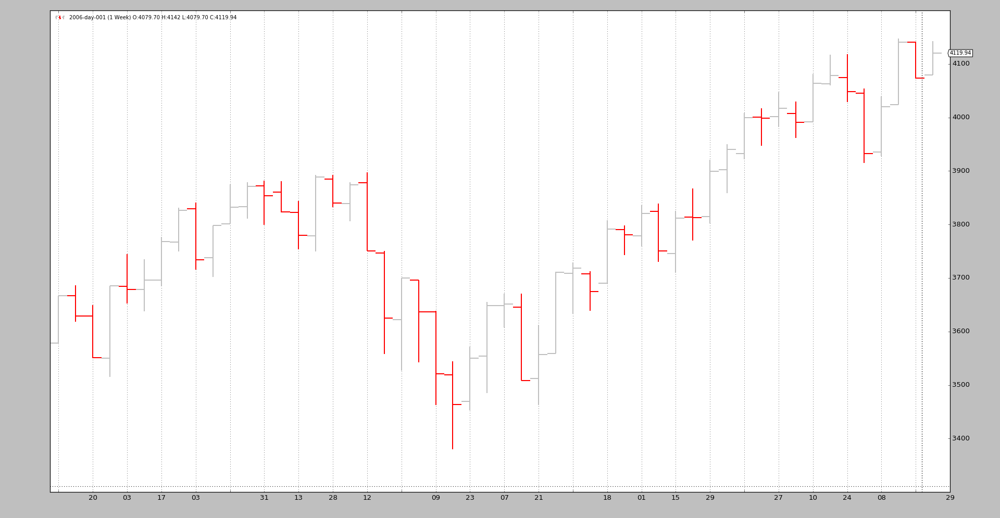
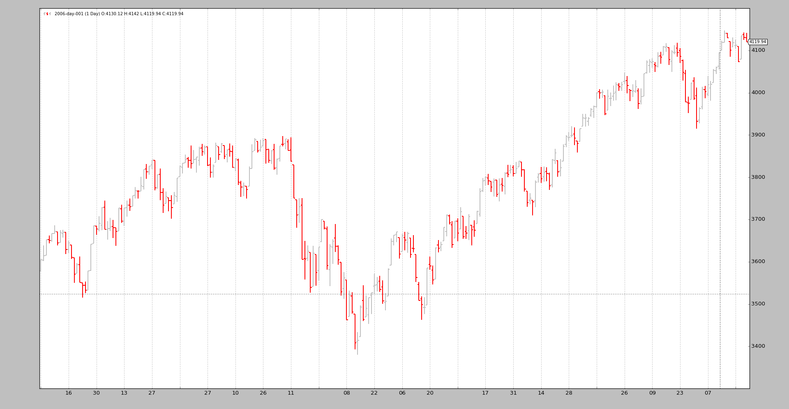
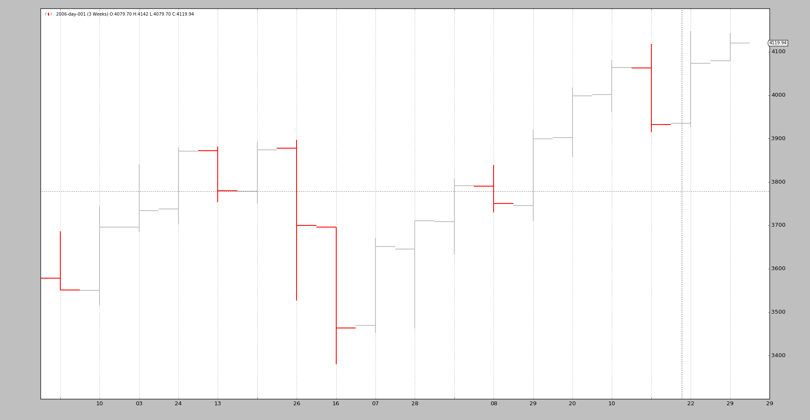

- [Data Feeds - Resample](#data-feeds---resample)
------------------------------------------
# Data Feeds - Resample
当数据仅在单个时间范围(`timeframe`)内可用并且必须在不同的时间范围(`timeframe`)内进行分析时，该进行一些重新采样了。

鉴于从源时间范围到更大的时间范围（例如：几天到几周），“重采样”实际上应称为“上采样”

`backtrader` 通过将原始数据传递到过滤器对象，内置了对重采样的支持。尽管有多种方法可以实现此目的，但存在一个简单的接口可以实现此目的：

* 相比 `cerebro.adddata(data)` 将 `data` 放入系统,  推荐使用
`cerebro.resampledata(data, **kwargs)`

有两个主要选项可以进行控制

* 更改 `timeframe`

* Compress bars

为此，请在调用 `resampledata` 时使用以下参数：

* `timeframe` （默认值：`bt.TimeFrame.Days`）   
  目标时间范围必须等于或大于源时间范围

* `compression` （默认值：1）   
  将所选值“ n”压缩到 1 bar

让我们来看一个从每日到每周的命令行脚本示例：
```
$ ./resampling-example.py --timeframe weekly --compression 1
```


和我们的原始每日数据图片进行对比
```
$ ./resampling-example.py --timeframe daily --compression 1
```


如此神奇的事情是通过如下步骤实现的:
* 加载数据
* 通过 `resampledata` ,带上期望的参数, 将数据传入 `cerebro`
    * timeframe
    * compression

部分代码(全部代码见后面)如下:
```
    # Load the Data
    datapath = args.dataname or '../../datas/2006-day-001.txt'
    data = btfeeds.BacktraderCSVData(dataname=datapath)

    # Handy dictionary for the argument timeframe conversion
    tframes = dict(
        daily=bt.TimeFrame.Days,
        weekly=bt.TimeFrame.Weeks,
        monthly=bt.TimeFrame.Months)

    # Add the resample data instead of the original
    cerebro.resampledata(data,
                         timeframe=tframes[args.timeframe],
                         compression=args.compression)
```

在最后一个示例中, 我们更改 timeframe 从 daily 变为 weekly, 然后应用 compression 3:
```
$ ./resampling-example.py --timeframe weekly --compression 3
```


从原始的256根 daily bars 到最后 18 根 3-week bars:

* 52 weeks
* 52/3 = 17.33 因此是18根bars 

当然，日内数据也可以重新采样。

重采样过滤器支持其他参数，在大多数情况下，使用不到这些参数：

* `bar2edge`（默认值：`True`）    
  使用时间边界作为目标进行重新采样。例如，使用“tick -> 5秒”，所得的5秒 bars 将与 xx：00，xx：05，xx：10 对齐。

* `adjbartime`（默认值：`True`）    
  使用边界处的时间调整交付的重采样条的时间，而不是最后一次看到的时间戳。如果重采样到“ 5秒”，则即使最后一次看到的时间戳是hh：mm：04.33，也会将条形时间调整为例如hh：mm：05。

> 注意 !     
> 仅当 `bar2edge` 为`True`时才调整时间。如果 bar 未与边界对齐，则调整时间没有任何意义

* `rightedge`（默认值：`True`）   
  使用时间边界的右边缘设置时间。
  
  如果为`False`并压缩到5秒，则在hh：mm：00和hh：mm：04之间重新采样的条形时间（以秒为单位）将为hh：mm：00（起始边界）
  
  如果为True，则该时间使用的边界为hh：mm：05（结束边界）

* `boundoff`（默认值：0）   
  推动边界以重采样/重放一定数量的单位。
  
  例如，如果重采样是从1分钟到15分钟，则默认行为是从00:01:00到 00:15:00选取1分钟的 bar，以产生15分钟的重播/重采样 bar。
  
  如果 `boundoff` 设置为1，则将边界1 unit 向前推。在这种情况下，原始单位为1分钟的 bar。因此，重新采样/重放现在将：
  * 使用从00:00:00到00:14:00的 bars 来生成15分钟的 bar

采样的示例代码如下:
```
from __future__ import (absolute_import, division, print_function,
                        unicode_literals)

import argparse

import backtrader as bt
import backtrader.feeds as btfeeds


def runstrat():
    args = parse_args()

    # Create a cerebro entity
    cerebro = bt.Cerebro(stdstats=False)

    # Add a strategy
    cerebro.addstrategy(bt.Strategy)

    # Load the Data
    datapath = args.dataname or '../../datas/2006-day-001.txt'
    data = btfeeds.BacktraderCSVData(dataname=datapath)

    # Handy dictionary for the argument timeframe conversion
    tframes = dict(
        daily=bt.TimeFrame.Days,
        weekly=bt.TimeFrame.Weeks,
        monthly=bt.TimeFrame.Months)

    # Add the resample data instead of the original
    cerebro.resampledata(data,
                         timeframe=tframes[args.timeframe],
                         compression=args.compression)

    # Run over everything
    cerebro.run()

    # Plot the result
    cerebro.plot(style='bar')


def parse_args():
    parser = argparse.ArgumentParser(
        description='Pandas test script')

    parser.add_argument('--dataname', default='', required=False,
                        help='File Data to Load')

    parser.add_argument('--timeframe', default='weekly', required=False,
                        choices=['daily', 'weekly', 'monhtly'],
                        help='Timeframe to resample to')

    parser.add_argument('--compression', default=1, required=False, type=int,
                        help='Compress n bars into 1')

    return parser.parse_args()


if __name__ == '__main__':
    runstrat()
```