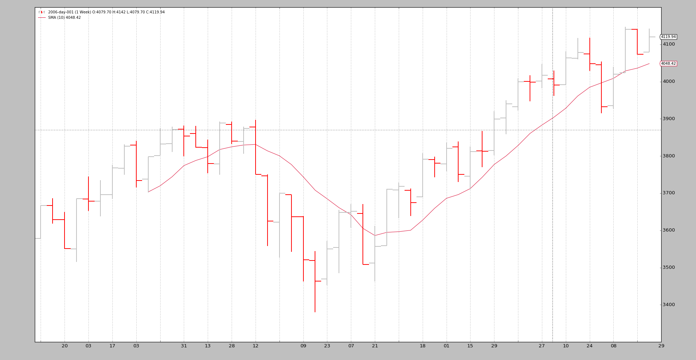
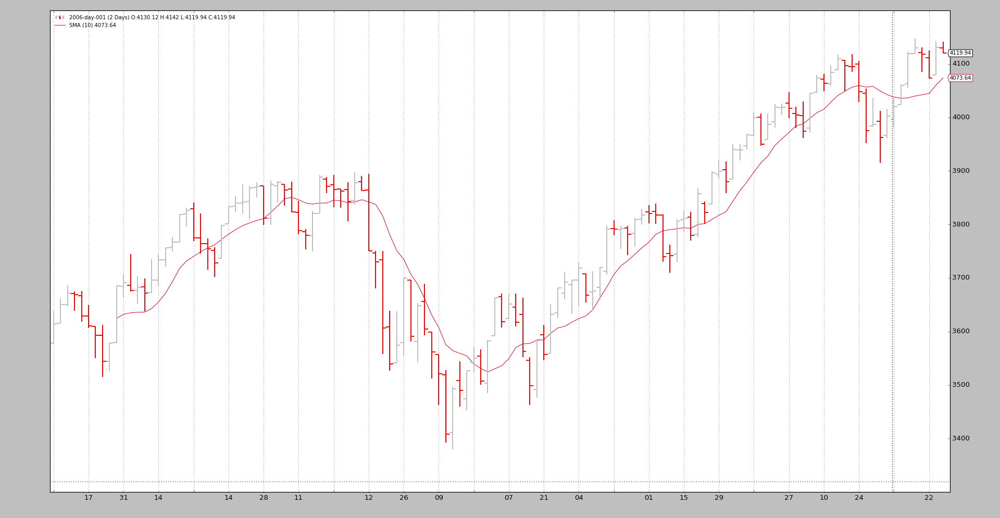

- [Data Feeds - Replay](#data-feeds---replay)
  - [Example - Replay Daily to Weekly](#example---replay-daily-to-weekly)
  - [Example 2 - Daily to Daily with Compression](#example-2---daily-to-daily-with-compression)
  - [Conclusion](#conclusion)
-----------------------------------------------
# Data Feeds - Replay
如果策略在 `timeframe` 为X的数据上运行（例如：daily）

可以在尝试下较小时间范围Y（例如1分钟）的数据

数据重放(`replay`)顾名思义：

* 使用 1 minute 数据重放 daily bar

当然，这并不完全是市场的运行方式，但比孤立地查看每日bar的收盘价要好得多：

如果策略在 daily bar 形成期间实时运行，则 bar 形成的近似值将为您提供在真实条件下复制策略实际行为的机会

`backtrader` 将数据重放付诸实践遵循以下常规用法 

* 加载数据Feed
* 通过 `replaydata` 将数据传递给脑 replaydata
* 添加策略

> 注意      
> 重放数据时不支持预加载，因为每个小节实际上都是实时构建的。在任何Cerebro实例中，它将自动禁用 。

可以传递给的参数`replaydata`：

* `timeframe` （默认值：`bt.TimeFrame.Days`）   
  目标时间范围必须等于或大于源时间范围

* `compression` （默认值：1）     
  将所选值“ n”压缩到1 bar

扩展参数（如非必要，请勿修改）：

* `bar2edge` （默认值：True）   
  使用时间边界作为封闭条的目标进行重放。例如，使用“tick-> 5秒”，所得的5秒 bar 将与xx：00，xx：05，xx：10对齐。

* `adjbartime` （默认值：False）    
  使用边界处的时间调整交付的重采样条的时间，而不是最后一次看到的时间戳。如果重采样到“ 5秒”，则即使最后一次看到的时间戳是hh：mm：04.33，也会将bar的时间调整为例如hh：mm：05。

> 注意：    
> 只有在“ bar2edge”为True时，才可以调整时间。如果 bar 未与边界对齐，则调整时间没有任何意义

* rightedge （默认值：True）    
  使用时间边界的右边缘设置时间。
  
  如果为False并压缩到5秒，则在hh：mm：00和hh：mm：04之间重新采样的条形时间（以秒为单位）将为hh：mm：00（起始边界）
  
  如果为True，则该时间使用的边界为hh：mm：05（结束边界）

为了便于举例，标准的2006年每日数据将每周重播一次。意思是：

* 最终将有52个bars，每个星期有一个

* `Cerebro` 会调用 `prenext` 和 `next` 共255次，也就是 daily bars 的原始计数

诀窍：

* 当形成每周 bar 之前，策略的长度 `len(self)` 将保持不变。

* 每过一周，时间就会增加一倍

下面是一些示例，首先是测试脚本的精髓，在该脚本中，数据被加载并通过replaydata…传递给cerebro ，然后是run。

```
    # Load the Data
    datapath = args.dataname or '../../datas/2006-day-001.txt'
    data = btfeeds.BacktraderCSVData(dataname=datapath)

    # Handy dictionary for the argument timeframe conversion
    tframes = dict(
        daily=bt.TimeFrame.Days,
        weekly=bt.TimeFrame.Weeks,
        monthly=bt.TimeFrame.Months)

    # First add the original data - smaller timeframe
    cerebro.replaydata(data,
                       timeframe=tframes[args.timeframe],
                       compression=args.compression)
```

## Example - Replay Daily to Weekly
命令行调用:
```
$ ./replay-example.py --timeframe weekly --compression 1
```
图表不能很好展示, 看下命令行输出结果吧:
```
prenext len 1 - counter 1
prenext len 1 - counter 2
prenext len 1 - counter 3
prenext len 1 - counter 4
prenext len 1 - counter 5
prenext len 2 - counter 6
...
...
prenext len 9 - counter 44
prenext len 9 - counter 45
---next len 10 - counter 46
---next len 10 - counter 47
---next len 10 - counter 48
---next len 10 - counter 49
---next len 10 - counter 50
---next len 11 - counter 51
---next len 11 - counter 52
---next len 11 - counter 53
...
...
---next len 51 - counter 248
---next len 51 - counter 249
---next len 51 - counter 250
---next len 51 - counter 251
---next len 51 - counter 252
---next len 52 - counter 253
---next len 52 - counter 254
---next len 52 - counter 255
```

如我们所见，内部 `self.counter` 变量会跟踪对prenext或next的每次调用。前者在应用的“简单移动平均线”之前调用会产生一个值。后者在简单移动平均线产生值时调用。

关键：

* 策略的长度（len（自身））每5个bars（一周中的5个交易日）改变一次

该策略有效地看到了：

* 每周的 bar 是如何在5次 shots 中发展出来的。

* 同样，这并不能复制市场的逐笔（甚至不是分钟，小时）发展，但总比实际看到一个标准要好。

视觉输出是每周图表的视觉输出，这是系统再次受到测试的最终结果。


## Example 2 - Daily to Daily with Compression
当然，“回放”也可以应用于同一时间段，但需要压缩。

The console:
```
$ ./replay-example.py --timeframe daily --compression 2
prenext len 1 - counter 1
prenext len 1 - counter 2
prenext len 2 - counter 3
prenext len 2 - counter 4
prenext len 3 - counter 5
prenext len 3 - counter 6
prenext len 4 - counter 7
...
...
---next len 125 - counter 250
---next len 126 - counter 251
---next len 126 - counter 252
---next len 127 - counter 253
---next len 127 - counter 254
---next len 128 - counter 255
```
这一次我们得到了一半的bars，因为系数2要求压缩。



## Conclusion
重建市场发展是可能的。通常一个较小的 timeframe 数据集是可用的，可以用来离散地重播系统运行的时间框架。

完整测试代码如下:
```
from __future__ import (absolute_import, division, print_function,
                        unicode_literals)

import argparse

import backtrader as bt
import backtrader.feeds as btfeeds
import backtrader.indicators as btind


class SMAStrategy(bt.Strategy):
    params = (
        ('period', 10),
        ('onlydaily', False),
    )

    def __init__(self):
        self.sma = btind.SMA(self.data, period=self.p.period)

    def start(self):
        self.counter = 0

    def prenext(self):
        self.counter += 1
        print('prenext len %d - counter %d' % (len(self), self.counter))

    def next(self):
        self.counter += 1
        print('---next len %d - counter %d' % (len(self), self.counter))


def runstrat():
    args = parse_args()

    # Create a cerebro entity
    cerebro = bt.Cerebro(stdstats=False)

    cerebro.addstrategy(
        SMAStrategy,
        # args for the strategy
        period=args.period,
    )

    # Load the Data
    datapath = args.dataname or '../../datas/2006-day-001.txt'
    data = btfeeds.BacktraderCSVData(dataname=datapath)

    # Handy dictionary for the argument timeframe conversion
    tframes = dict(
        daily=bt.TimeFrame.Days,
        weekly=bt.TimeFrame.Weeks,
        monthly=bt.TimeFrame.Months)

    # First add the original data - smaller timeframe
    cerebro.replaydata(data,
                       timeframe=tframes[args.timeframe],
                       compression=args.compression)

    # Run over everything
    cerebro.run()

    # Plot the result
    cerebro.plot(style='bar')


def parse_args():
    parser = argparse.ArgumentParser(
        description='Pandas test script')

    parser.add_argument('--dataname', default='', required=False,
                        help='File Data to Load')

    parser.add_argument('--timeframe', default='weekly', required=False,
                        choices=['daily', 'weekly', 'monhtly'],
                        help='Timeframe to resample to')

    parser.add_argument('--compression', default=1, required=False, type=int,
                        help='Compress n bars into 1')

    parser.add_argument('--period', default=10, required=False, type=int,
                        help='Period to apply to indicator')

    return parser.parse_args()


if __name__ == '__main__':
    runstrat()
```