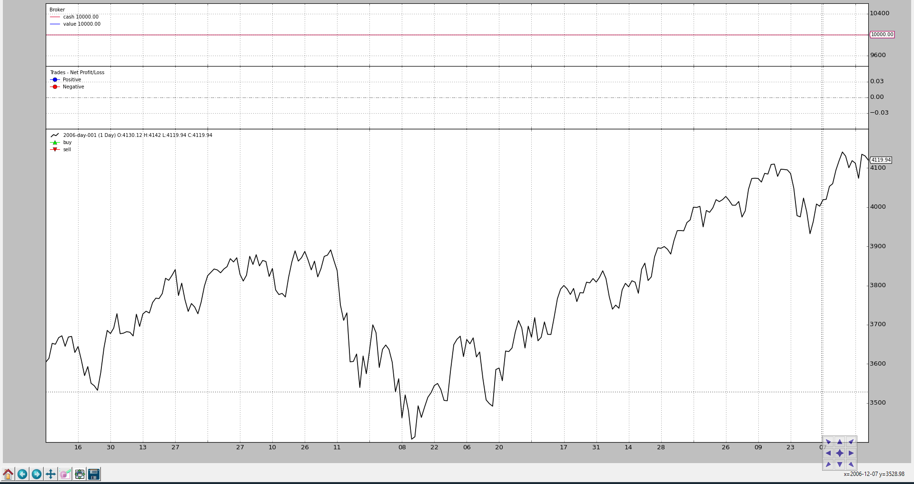

- [Observers and Statistics](#observers-and-statistics)
  - [Accesing the Observers](#accesing-the-observers)
  - [Observer Implementation](#observer-implementation)
  - [Adding Observers to the Strategy](#adding-observers-to-the-strategy)
  - [Developing Observers](#developing-observers)
    - [Custom OrderObserver](#custom-orderobserver)
  - [Saving/Keeping the statistics](#savingkeeping-the-statistics)
- [Observers - Benchmarking](#observers---benchmarking)
- [Observers - Reference](#observers---reference)

---------------------------------------------------
# Observers and Statistics
策略在 backtrader 中运行，主要处理 datas 与 indicators

数据被添加到 cerebro 实例中，最终会成为策略输入的一部分(被解析作为实例的属性), 而指标由策略本身申明与管理。

到目前为止，所有backtrader的样本图表都有3个东西似乎是理所当然的，因为它们没有在任何地方声明:
* `Cash` and `Value` (what’s happening with the money in the broker)
* `Trades` (aka Operations)
* Buy/Sell `Orders`

它们是 `Observers` ，存在于 `backtrader.observers` 子模块中。它们存在是因为 `Cerebro` 支持一个参数来自动将它们添加(或不添加)到策略中：

* stdstats (default: True)  

如果为默认值, Cerebro 等价于执行以下代码:
```
import backtrader as bt

...

cerebro = bt.Cerebro()  # default kwarg: stdstats=True

cerebro.addobserver(bt.observers.Broker)
cerebro.addobserver(bt.observers.Trades)
cerebro.addobserver(bt.observers.BuySell)
```
让我们看看这3个默认观察者的图表(即使没有发出指令，因此没有交易发生，现金和投资组合价值也没有变化)
```
from __future__ import (absolute_import, division, print_function,
                        unicode_literals)

import backtrader as bt
import backtrader.feeds as btfeeds

if __name__ == '__main__':
    cerebro = bt.Cerebro(stdstats=False)
    cerebro.addstrategy(bt.Strategy)

    data = bt.feeds.BacktraderCSVData(dataname='../../datas/2006-day-001.txt')
    cerebro.adddata(data)

    cerebro.run()
    cerebro.plot()
```


现在让我们在创建 `Cerebro` 实例时将 `stdstats` 的值更改为 `False` (也可以在调用run时完成):
```
cerebro = bt.Cerebro(stdstats=False)
```


## Accesing the Observers
上面所看到的观察者在默认情况下已经在那里了，并且收集了可以用于统计目的的信息，这就是为什么对观察者的访问可以通过策略的一个属性来完成:

* stats

它只是一个占位符。如果我们回想一下上面添加的一个默认观察者:
```
...
cerebro.addobserver(backtrader.observers.Broker)
...
```

显而易见的问题是如何访问 Broker 观察者。这里举个例子，如何从策略的 `next` 方法着手:
```
class MyStrategy(bt.Strategy):

    def next(self):

        if self.stats.broker.value[0] < 1000.0:
           print('WHITE FLAG ... I LOST TOO MUCH')
        elif self.stats.broker.value[0] > 10000000.0:
           print('TIME FOR THE VIRGIN ISLANDS ....!!!')
```

 `Broker` 观察者就像一个数据、一个指标，而策略本身也是一个 `Lines` 对象。在本例中，`Broker` 有两个 `lines`:
* `cash`
* `value`

## Observer Implementation
实现非常类似于一个指标:
```
class Broker(Observer):
    alias = ('CashValue',)
    lines = ('cash', 'value')

    plotinfo = dict(plot=True, subplot=True)

    def next(self):
        self.lines.cash[0] = self._owner.broker.getcash()
        self.lines.value[0] = value = self._owner.broker.getvalue()
```

步骤:
* 继承与Observer(不是Indicator)
* 根据需要声明 lines 和 参数（Broker有两个lines，但没有params）
* 将有一个自动属性 `_owner`，它是容纳观察者的 `strategy` (OS: 这个真的有意思，observer在strategy.stats里面，但strategy却在observer_owner里面)

Observers 的动作:
* 在所有的指标计算完成之后
* 然后策略的 `next` 方法之后执行
* 这意味在一个循环的最后，观察发生了什么

在 Broker 的例子中，它只是盲目地记录 broker 在每个时间点的 cash 和 投资组合的价值。

## Adding Observers to the Strategy
正如上面已经指出的，`Cerebro` 使用参数 `stdstats` 来决定是否添加3个默认观察者，减轻最终用户的工作。

可以添加其他观察器，可以随着 stdstats 添加，也可以删除它们。

让我们看一个通用的策略，当收盘价高于 SMA 时买入，反之则卖出。

添加一个观察者:
* `DrawDown`: 在 backtrader 生态系统中已经存在的一个观察者  
```
from __future__ import (absolute_import, division, print_function,
                        unicode_literals)

import argparse
import datetime
import os.path
import time
import sys


import backtrader as bt
import backtrader.feeds as btfeeds
import backtrader.indicators as btind


class MyStrategy(bt.Strategy):
    params = (('smaperiod', 15),)

    def log(self, txt, dt=None):
        ''' Logging function fot this strategy'''
        dt = dt or self.data.datetime[0]
        if isinstance(dt, float):
            dt = bt.num2date(dt)
        print('%s, %s' % (dt.isoformat(), txt))

    def __init__(self):
        # SimpleMovingAverage on main data
        # Equivalent to -> sma = btind.SMA(self.data, period=self.p.smaperiod)
        sma = btind.SMA(period=self.p.smaperiod)

        # CrossOver (1: up, -1: down) close / sma
        self.buysell = btind.CrossOver(self.data.close, sma, plot=True)

        # Sentinel to None: new ordersa allowed
        self.order = None

    def next(self):
        # Access -1, because drawdown[0] will be calculated after "next"
        self.log('DrawDown: %.2f' % self.stats.drawdown.drawdown[-1])
        self.log('MaxDrawDown: %.2f' % self.stats.drawdown.maxdrawdown[-1])

        # Check if we are in the market
        if self.position:
            if self.buysell < 0:
                self.log('SELL CREATE, %.2f' % self.data.close[0])
                self.sell()

        elif self.buysell > 0:
            self.log('BUY CREATE, %.2f' % self.data.close[0])
            self.buy()


def runstrat():
    cerebro = bt.Cerebro()

    data = bt.feeds.BacktraderCSVData(dataname='../../datas/2006-day-001.txt')
    cerebro.adddata(data)

    cerebro.addobserver(bt.observers.DrawDown)

    cerebro.addstrategy(MyStrategy)
    cerebro.run()

    cerebro.plot()


if __name__ == '__main__':
    runstrat()
```


```
...
2006-12-14T23:59:59+00:00, MaxDrawDown: 2.62
2006-12-15T23:59:59+00:00, DrawDown: 0.22
2006-12-15T23:59:59+00:00, MaxDrawDown: 2.62
2006-12-18T23:59:59+00:00, DrawDown: 0.00
2006-12-18T23:59:59+00:00, MaxDrawDown: 2.62
2006-12-19T23:59:59+00:00, DrawDown: 0.00
2006-12-19T23:59:59+00:00, MaxDrawDown: 2.62
2006-12-20T23:59:59+00:00, DrawDown: 0.10
2006-12-20T23:59:59+00:00, MaxDrawDown: 2.62
2006-12-21T23:59:59+00:00, DrawDown: 0.39
2006-12-21T23:59:59+00:00, MaxDrawDown: 2.62
2006-12-22T23:59:59+00:00, DrawDown: 0.21
2006-12-22T23:59:59+00:00, MaxDrawDown: 2.62
2006-12-27T23:59:59+00:00, DrawDown: 0.28
2006-12-27T23:59:59+00:00, MaxDrawDown: 2.62
2006-12-28T23:59:59+00:00, DrawDown: 0.65
2006-12-28T23:59:59+00:00, MaxDrawDown: 2.62
2006-12-29T23:59:59+00:00, DrawDown: 0.06
2006-12-29T23:59:59+00:00, MaxDrawDown: 2.62
```
 下面是DrawDown观察者的源码: 
```
class DrawDown(Observer):
    '''This observer keeps track of the current drawdown level (plotted) and
    the maxdrawdown (not plotted) levels
 
    Params:
 
      - ``fund`` (default: ``None``)
 
        If ``None`` the actual mode of the broker (fundmode - True/False) will
        be autodetected to decide if the returns are based on the total net
        asset value or on the fund value. See ``set_fundmode`` in the broker
        documentation
 
        Set it to ``True`` or ``False`` for a specific behavior
 
    '''
    _stclock = True
 
    params = (
        ('fund', None),
    )
 
    lines = ('drawdown', 'maxdrawdown',)
 
    plotinfo = dict(plot=True, subplot=True)
 
    plotlines = dict(maxdrawdown=dict(_plotskip=True,))
 
    def __init__(self):
        kwargs = self.p._getkwargs()
        self._dd = self._owner._addanalyzer_slave(bt.analyzers.DrawDown,
                                                  **kwargs)
 
    def next(self):
        self.lines.drawdown[0] = self._dd.rets.drawdown  # update drawdown
        self.lines.maxdrawdown[0] = self._dd.rets.max.drawdown  # update max
```

> 从文本输出的代码中可以看到，DrawDown observer实际上有两行:
> * `drawdown`
> * `maxdrawdown`

选择 `maxdrawdown` 不被画出来，而用户仍然可让其绘制

实际上，`maxdrawdown` 的最后一个值也可以在名为 `maxdd` 的直接属性（而不是line）中使用

## Developing Observers
上面显示了Broker observer的实现。为了产生有意义的观察者，实现可以使用以下信息：

* `self._owner` 是当前正在执行的策略    
    因此，策略中的任何东西都可供观察者使用

* 策略中可用的默认内部信息可能有用:
    
    * `broker`:     
        通过 `broker` 属性能够访问策略创建订单的 `broker` 实例

        如 `Broker` 中所示，cash 和 投资组合价值 是通过调用 `getcash` 和 `getvalue` 方法来收集的

    * `_orderspending`:   
        列出 `broker` 将事件通知策略之后策略创建的 `orders`。

        `BuySell observer` 遍历列表，寻找已执行（全部或部分）的订单，以创建在给定时间点（索引0）的平均执行价格
    
    * `_tradespending`:     
        trades 列表（一组完整的 买入/卖出 或 卖出/买入 对），由 买入/卖出 指令(order) 编译而成

一个 `Observer` 显然能够通过 `self._owner.stats` 的方法访问其他观察者

### Custom OrderObserver
标准的 `BuySell` 观察者只关心已经执行的操作。我们可以创建一个观察者来显示 orders 何时何地创建以及是否过期

为了便于查看，显示不会与价格绘制在一起，而是在单独的轴上绘制。
```
from __future__ import (absolute_import, division, print_function,
                        unicode_literals)

import math

import backtrader as bt


class OrderObserver(bt.observer.Observer):
    lines = ('created', 'expired',)

    plotinfo = dict(plot=True, subplot=True, plotlinelabels=True)

    plotlines = dict(
        created=dict(marker='*', markersize=8.0, color='lime', fillstyle='full'),
        expired=dict(marker='s', markersize=8.0, color='red', fillstyle='full')
    )

    def next(self):
        for order in self._owner._orderspending:
            if order.data is not self.data:
                continue

            if not order.isbuy():
                continue

            # Only interested in "buy" orders, because the sell orders
            # in the strategy are Market orders and will be immediately
            # executed

            if order.status in [bt.Order.Accepted, bt.Order.Submitted]:
                self.lines.created[0] = order.created.price

            elif order.status in [bt.Order.Expired]:
                self.lines.expired[0] = order.created.price
```

这个自定义观察者只关心 `buy orders`，因为这是一个只有 buy 的策略。Sell orders 是市价单，立即执行的

Close-SMA 交叉策略被修改为:
* 创建一个价格低于信号时刻收盘价1.0%的限价单
* 订单有效期为7(日历)天
结果如下图所示:


从新的子图(红色方块)中可以看出，有几个订单已经过期，我们也可以看出，“创建”和“执行”之间正好有几天时间。

> 从开发分支中的commit 1560fa8802开始，如果在创建订单时价格未设置，则收盘价将用作参考价格。这对市场订单没有影响，但是订单创建价格随时可用，简化了buy的使用

最终, 使用新的 observer 的代码如下:
```
from __future__ import (absolute_import, division, print_function,
                        unicode_literals)

import datetime

import backtrader as bt
import backtrader.feeds as btfeeds
import backtrader.indicators as btind

from orderobserver import OrderObserver


class MyStrategy(bt.Strategy):
    params = (
        ('smaperiod', 15),
        ('limitperc', 1.0),
        ('valid', 7),
    )

    def log(self, txt, dt=None):
        ''' Logging function fot this strategy'''
        dt = dt or self.data.datetime[0]
        if isinstance(dt, float):
            dt = bt.num2date(dt)
        print('%s, %s' % (dt.isoformat(), txt))

    def notify_order(self, order):
        if order.status in [order.Submitted, order.Accepted]:
            # Buy/Sell order submitted/accepted to/by broker - Nothing to do
            self.log('ORDER ACCEPTED/SUBMITTED', dt=order.created.dt)
            self.order = order
            return

        if order.status in [order.Expired]:
            self.log('BUY EXPIRED')

        elif order.status in [order.Completed]:
            if order.isbuy():
                self.log(
                    'BUY EXECUTED, Price: %.2f, Cost: %.2f, Comm %.2f' %
                    (order.executed.price,
                     order.executed.value,
                     order.executed.comm))

            else:  # Sell
                self.log('SELL EXECUTED, Price: %.2f, Cost: %.2f, Comm %.2f' %
                         (order.executed.price,
                          order.executed.value,
                          order.executed.comm))

        # Sentinel to None: new orders allowed
        self.order = None

    def __init__(self):
        # SimpleMovingAverage on main data
        # Equivalent to -> sma = btind.SMA(self.data, period=self.p.smaperiod)
        sma = btind.SMA(period=self.p.smaperiod)

        # CrossOver (1: up, -1: down) close / sma
        self.buysell = btind.CrossOver(self.data.close, sma, plot=True)

        # Sentinel to None: new ordersa allowed
        self.order = None

    def next(self):
        if self.order:
            # pending order ... do nothing
            return

        # Check if we are in the market
        if self.position:
            if self.buysell < 0:
                self.log('SELL CREATE, %.2f' % self.data.close[0])
                self.sell()

        elif self.buysell > 0:
            plimit = self.data.close[0] * (1.0 - self.p.limitperc / 100.0)
            valid = self.data.datetime.date(0) + \
                datetime.timedelta(days=self.p.valid)
            self.log('BUY CREATE, %.2f' % plimit)
            self.buy(exectype=bt.Order.Limit, price=plimit, valid=valid)


def runstrat():
    cerebro = bt.Cerebro()

    data = bt.feeds.BacktraderCSVData(dataname='../../datas/2006-day-001.txt')
    cerebro.adddata(data)

    cerebro.addobserver(OrderObserver)

    cerebro.addstrategy(MyStrategy)
    cerebro.run()

    cerebro.plot()


if __name__ == '__main__':
    runstrat()
```
## Saving/Keeping the statistics
到目前为止，backtrader 还没有实现任何机制来跟踪将它们存储到文件中的观察者的值。最好的方法是：

* 在策略的 `start` 方法中打开一个文件
* 在策略的 `next` 方法中写下这些值

考虑到`DrawDown observer`，可以这样做：
```
class MyStrategy(bt.Strategy):

    def start(self):

        self.mystats = open('mystats.csv', 'wb')
        self.mystats.write('datetime,drawdown, maxdrawdown\n')

    def next(self):
        self.mystats.write(self.data.datetime.date(0).strftime('%Y-%m-%d'))
        self.mystats.write(',%.2f' % self.stats.drawdown.drawdown[-1])
        self.mystats.write(',%.2f' % self.stats.drawdown.maxdrawdown-1])
        self.mystats.write('\n')
```
为了保存索引0的值，一旦所有观察者都处理完毕，可以添加一个写入文件的自定义观察者，作为系统最后一个将值保存到csv文件的观察者。

> Writer 可以自动完成这个工作 

----------------------------------------------------
# [Observers - Benchmarking](./mkd02_Benchmarking.md)
# [Observers - Reference](./mkd03_Reference.md)