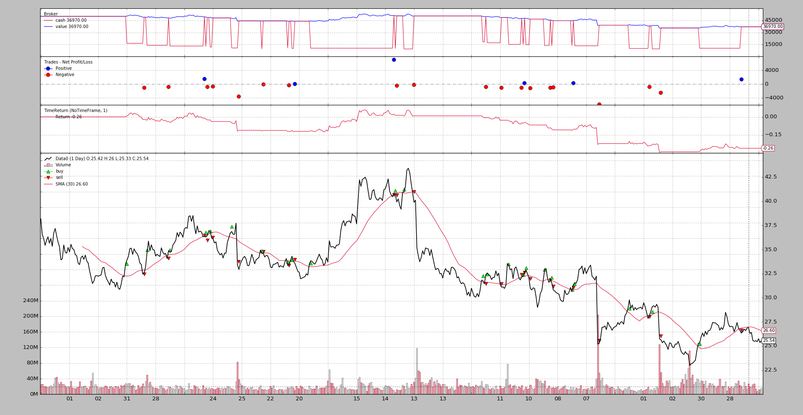
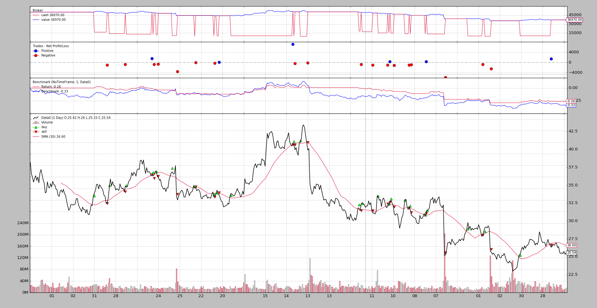
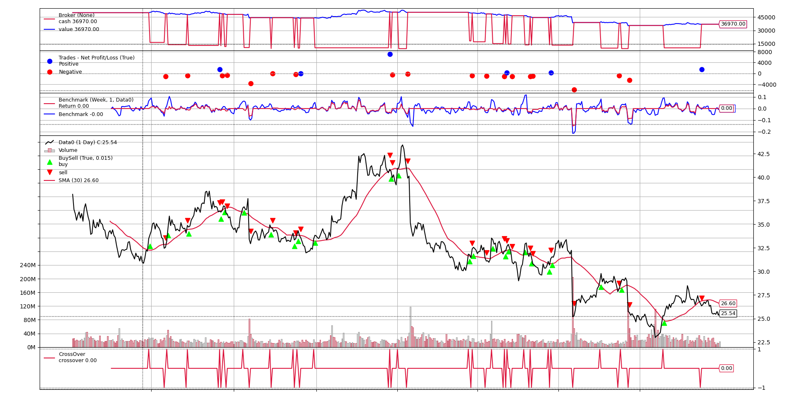

- [Benchmarking](#benchmarking)
  - [Analyzers - Benchmarking](#analyzers---benchmarking)
  - [Observers - Benchmarking](#observers---benchmarking)
    - [Observing TimeReturn](#observing-timereturn)
    - [Observing Benchmarking](#observing-benchmarking)
    - [Observing Benchmarking - Another data](#observing-benchmarking---another-data)
  - [Concluding](#concluding)
    - [The code](#the-code)

------------------------------------------------------
# Benchmarking
[Ticket #89](https://github.com/mementum/backtrader/issues/89)是关于增加资产跑分的功能. 有一种情况, 实际上策略只要简单的跟随资产变动, 就有正向收益。

backtrader包括2种不同类型的对象，可帮助进行跟踪：
* Observers
* Analyzers

在 Analyzers 这有个 `TimeReturn` 对象, 可以用来追踪整个组合价值(包括 cash) 的收益的变化过程.

也可以有一个Observer, 增加一些 benchmarking , 和 Observer 和 Analyzers 一起追踪同样的事情, 比如画图和实时查询. 当然这是消耗内存的.

>  `Observers` and `Analyzers` 之间的主要区别是 `lines`, 其中 observers 记录每一个值，这使得它们适合做这个事情

另一方面，`Analyzers` 通过 `get_analysis` 返回一组结果，可能直到运行的最后才交付一些结果。

## Analyzers - Benchmarking
标准的 `TimeReturn` analyzer 已经支持追踪 data feed. 主要是以下两个参数控制的:

* `timeframe` (default: `None`)     
    如果为 None , 将报告全部回测周期的 return

    传 `TimeFrame.NoTimeFrame` 将被认为不带时间限制的全部数据

* `data` (default: `None`)      
    引用 asset 来替代 portfolio value 去 track

    > 添加的data必须是通过 cerebro 实例的 addata/resampledata/replaydata 方法

更多信息和参数, 看 Analyzers 参考文档

portfolio 年化 return 追踪例子如下:
```
import backtrader as bt

cerebro = bt.Cerebro()
cerebro.addanalyzer(bt.analyzers.TimeReturn, timeframe=bt.TimeFrame.Years)

...  # add datas, strategies ...

results = cerebro.run()
strat0 = results[0]

# If no name has been specified, the name is the class name lowercased
tret_analyzer = strat0.analyzers.getbyname('timereturn')
print(tret_analyzer.get_analysis())
```

如果我们想 track 数据的 return, 代码如下:
```
import backtrader as bt

cerebro = bt.Cerebro()

data = bt.feeds.OneOfTheFeeds(dataname='abcde', ...)
cerebro.adddata(data)

cerebro.addanalyzer(bt.analyzers.TimeReturn, timeframe=bt.TimeFrame.Years,
                    data=data)

...  # add strategies ...

results = cerebro.run()
strat0 = results[0]

# If no name has been specified, the name is the class name lowercased
tret_analyzer = strat0.analyzers.getbyname('timereturn')
print(tret_analyzer.get_analysis())
```

如果两个都想track, 最好给 analyzers 赋个名字:
```
import backtrader as bt

cerebro = bt.Cerebro()

data = bt.feeds.OneOfTheFeeds(dataname='abcde', ...)
cerebro.adddata(data)

cerebro.addanalyzer(bt.analyzers.TimeReturn, timeframe=bt.TimeFrame.Years,
                    data=data, _name='datareturns')

cerebro.addanalyzer(bt.analyzers.TimeReturn, timeframe=bt.TimeFrame.Years)
                    _name='timereturns')

...  # add strategies ...

results = cerebro.run()
strat0 = results[0]

# If no name has been specified, the name is the class name lowercased
tret_analyzer = strat0.analyzers.getbyname('timereturns')
print(tret_analyzer.get_analysis())
tdata_analyzer = strat0.analyzers.getbyname('datareturns')
print(tdata_analyzer.get_analysis())
```

## Observers - Benchmarking
由于在 Observers 中可以使用 Analyzers, 可以增加2个新的observers:

* TimeReturn
* Benchmark

他们都使用 `bt.analyzers.TimeReturn` 收集结果

相比上面的代码片段, 一个完整的例子显示该功能

### Observing TimeReturn
执行脚本:
```
$ ./observer-benchmark.py --plot --timereturn --timeframe notimeframe
```


脚本执行可选参数:
* `--timereturn`, 表示执行 timereturn 的例子
* `--timeframe`, notimeframe 表示考虑全部数据, 忽视 `timeframe` 边界

最后画出的值是 -0.26
* 开始 cash 是 50K, 策略结束是 36,970, 因此 -26% 亏损

### Observing Benchmarking
因为 benchmarking 也会显示 timereturn 结果, 让我们运行同样的脚本, 这次带上 benchmarking:
```
$ ./observer-benchmark.py --plot --timeframe notimeframe
```


* 策略比只看 asset 好些: -0.26 vs -0.33     
    这不应该是值得庆祝的事情，但至少可以肯定的是，该 策略 比 asset 好点

接下来我们看下 yearly 基础上的结果:
```
$ ./observer-benchmark.py --plot --timeframe years
```


卧槽!
* 策略最终结果有了轻微变化: -0.26 到 -0.27
* asset 最终结果为 -0.35(相比之前 -0.33)

结果轻微变化的原因是由于从2005到2006, 策略 和 benchmarking asset 都机会在2005开始位置算起

切换到一个更低的 timeframe, 比如weeks, 图片就完全不一样了:
```
$ ./observer-benchmark.py --plot --timeframe weeks
```


现在:
* Benchmark observer显示一个更加敏感的曲线, 频繁上下, 因为现在track的是portfolio和数据的 weekly return

* 因为最后一周没有交易, asset 几乎没动, 最终显示 0.00(最后一周前的最后的closing值是25.54, sample data 收盘在25.55, 差价首先出现在小数点后第4位)

### Observing Benchmarking - Another data
该样本允许针对不同的数据进行基准测试。默认是针对甲骨文的基准, 使用`--benchdata1`。考虑整个数据集, 使用 `--timeframe notimeframe`：
```
$ ./observer-benchmark.py --plot --timeframe notimeframe --benchdata1
```


现在很清楚，为什么上面没有理由庆祝：

* 策略的结果未更改 `notimeframe`，仍为 -26%（-0.26）
* 但是，当以其他数据作为基准时，该数据在同一时间段内带有+23% （0.23）

要么策略需要改变，要么交易一个更好的标的asset。

## Concluding
有两种方式, 使用同样的底层代码/计算, 来track `TimeReturn` 和 `Benchmark`

* `Observers` (`TimeReturn` and `Benchmark`)

* `Analyzer` (`TimeReturn` and `TimeReturn` with a `data` parameter)    
当然, benchmarking 不保证收益, 只用了比较

Usage of the sample:
```
$ ./observer-benchmark.py --help
usage: observer-benchmark.py [-h] [--data0 DATA0] [--data1 DATA1]
                             [--benchdata1] [--fromdate FROMDATE]
                             [--todate TODATE] [--printout] [--cash CASH]
                             [--period PERIOD] [--stake STAKE] [--timereturn]
                             [--timeframe {months,days,notimeframe,years,None,weeks}]
                             [--plot [kwargs]]

Benchmark/TimeReturn Observers Sample

optional arguments:
  -h, --help            show this help message and exit
  --data0 DATA0         Data0 to be read in (default:
                        ../../datas/yhoo-1996-2015.txt)
  --data1 DATA1         Data1 to be read in (default:
                        ../../datas/orcl-1995-2014.txt)
  --benchdata1          Benchmark against data1 (default: False)
  --fromdate FROMDATE   Starting date in YYYY-MM-DD format (default:
                        2005-01-01)
  --todate TODATE       Ending date in YYYY-MM-DD format (default: 2006-12-31)
  --printout            Print data lines (default: False)
  --cash CASH           Cash to start with (default: 50000)
  --period PERIOD       Period for the crossover moving average (default: 30)
  --stake STAKE         Stake to apply for the buy operations (default: 1000)
  --timereturn          Use TimeReturn observer instead of Benchmark (default:
                        None)
  --timeframe {months,days,notimeframe,years,None,weeks}
                        TimeFrame to apply to the Observer (default: None)
  --plot [kwargs], -p [kwargs]
                        Plot the read data applying any kwargs passed For
                        example: --plot style="candle" (to plot candles)
                        (default: None)
```

### The code
```
from __future__ import (absolute_import, division, print_function,
                        unicode_literals)


import argparse
import datetime
import random

import backtrader as bt


class St(bt.Strategy):
    params = (
        ('period', 10),
        ('printout', False),
        ('stake', 1000),
    )

    def __init__(self):
        sma = bt.indicators.SMA(self.data, period=self.p.period)
        self.crossover = bt.indicators.CrossOver(self.data, sma)

    def start(self):
        if self.p.printout:
            txtfields = list()
            txtfields.append('Len')
            txtfields.append('Datetime')
            txtfields.append('Open')
            txtfields.append('High')
            txtfields.append('Low')
            txtfields.append('Close')
            txtfields.append('Volume')
            txtfields.append('OpenInterest')
            print(','.join(txtfields))

    def next(self):
        if self.p.printout:
            # Print only 1st data ... is just a check that things are running
            txtfields = list()
            txtfields.append('%04d' % len(self))
            txtfields.append(self.data.datetime.datetime(0).isoformat())
            txtfields.append('%.2f' % self.data0.open[0])
            txtfields.append('%.2f' % self.data0.high[0])
            txtfields.append('%.2f' % self.data0.low[0])
            txtfields.append('%.2f' % self.data0.close[0])
            txtfields.append('%.2f' % self.data0.volume[0])
            txtfields.append('%.2f' % self.data0.openinterest[0])
            print(','.join(txtfields))

        if self.position:
            if self.crossover < 0.0:
                if self.p.printout:
                    print('CLOSE {} @%{}'.format(size,
                                                 self.data.close[0]))
                self.close()

        else:
            if self.crossover > 0.0:
                self.buy(size=self.p.stake)
                if self.p.printout:
                    print('BUY   {} @%{}'.format(self.p.stake,
                                                self.data.close[0]))


TIMEFRAMES = {
    None: None,
    'days': bt.TimeFrame.Days,
    'weeks': bt.TimeFrame.Weeks,
    'months': bt.TimeFrame.Months,
    'years': bt.TimeFrame.Years,
    'notimeframe': bt.TimeFrame.NoTimeFrame,
}


def runstrat(args=None):
    args = parse_args(args)

    cerebro = bt.Cerebro()
    cerebro.broker.set_cash(args.cash)

    dkwargs = dict()
    if args.fromdate:
        fromdate = datetime.datetime.strptime(args.fromdate, '%Y-%m-%d')
        dkwargs['fromdate'] = fromdate

    if args.todate:
        todate = datetime.datetime.strptime(args.todate, '%Y-%m-%d')
        dkwargs['todate'] = todate

    data0 = bt.feeds.YahooFinanceCSVData(dataname=args.data0, **dkwargs)
    cerebro.adddata(data0, name='Data0')

    cerebro.addstrategy(St,
                        period=args.period,
                        stake=args.stake,
                        printout=args.printout)

    if args.timereturn:
        cerebro.addobserver(bt.observers.TimeReturn,
                            timeframe=TIMEFRAMES[args.timeframe])
    else:
        benchdata = data0
        if args.benchdata1:
            data1 = bt.feeds.YahooFinanceCSVData(dataname=args.data1, **dkwargs)
            cerebro.adddata(data1, name='Data1')
            benchdata = data1

        cerebro.addobserver(bt.observers.Benchmark,
                            data=benchdata,
                            timeframe=TIMEFRAMES[args.timeframe])

    cerebro.run()

    if args.plot:
        pkwargs = dict()
        if args.plot is not True:  # evals to True but is not True
            pkwargs = eval('dict(' + args.plot + ')')  # args were passed

        cerebro.plot(**pkwargs)


def parse_args(pargs=None):

    parser = argparse.ArgumentParser(
        formatter_class=argparse.ArgumentDefaultsHelpFormatter,
        description='Benchmark/TimeReturn Observers Sample')

    parser.add_argument('--data0', required=False,
                        default='../../datas/yhoo-1996-2015.txt',
                        help='Data0 to be read in')

    parser.add_argument('--data1', required=False,
                        default='../../datas/orcl-1995-2014.txt',
                        help='Data1 to be read in')

    parser.add_argument('--benchdata1', required=False, action='store_true',
                        help=('Benchmark against data1'))

    parser.add_argument('--fromdate', required=False,
                        default='2005-01-01',
                        help='Starting date in YYYY-MM-DD format')

    parser.add_argument('--todate', required=False,
                        default='2006-12-31',
                        help='Ending date in YYYY-MM-DD format')

    parser.add_argument('--printout', required=False, action='store_true',
                        help=('Print data lines'))

    parser.add_argument('--cash', required=False, action='store',
                        type=float, default=50000,
                        help=('Cash to start with'))

    parser.add_argument('--period', required=False, action='store',
                        type=int, default=30,
                        help=('Period for the crossover moving average'))

    parser.add_argument('--stake', required=False, action='store',
                        type=int, default=1000,
                        help=('Stake to apply for the buy operations'))

    parser.add_argument('--timereturn', required=False, action='store_true',
                        default=None,
                        help=('Use TimeReturn observer instead of Benchmark'))

    parser.add_argument('--timeframe', required=False, action='store',
                        default=None, choices=TIMEFRAMES.keys(),
                        help=('TimeFrame to apply to the Observer'))

    # Plot options
    parser.add_argument('--plot', '-p', nargs='?', required=False,
                        metavar='kwargs', const=True,
                        help=('Plot the read data applying any kwargs passed\n'
                              '\n'
                              'For example:\n'
                              '\n'
                              '  --plot style="candle" (to plot candles)\n'))

    if pargs:
        return parser.parse_args(pargs)

    return parser.parse_args()


if __name__ == '__main__':
    runstrat()
```