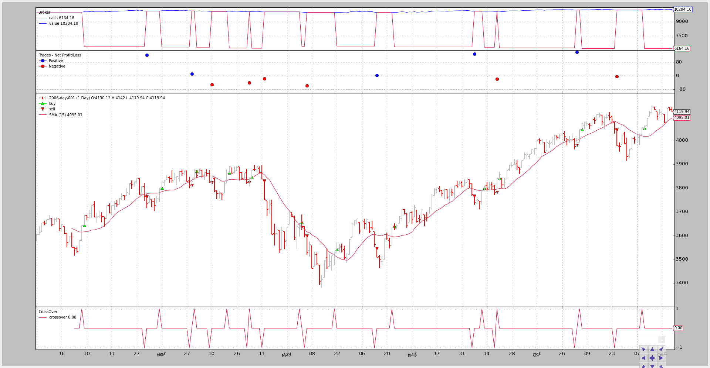
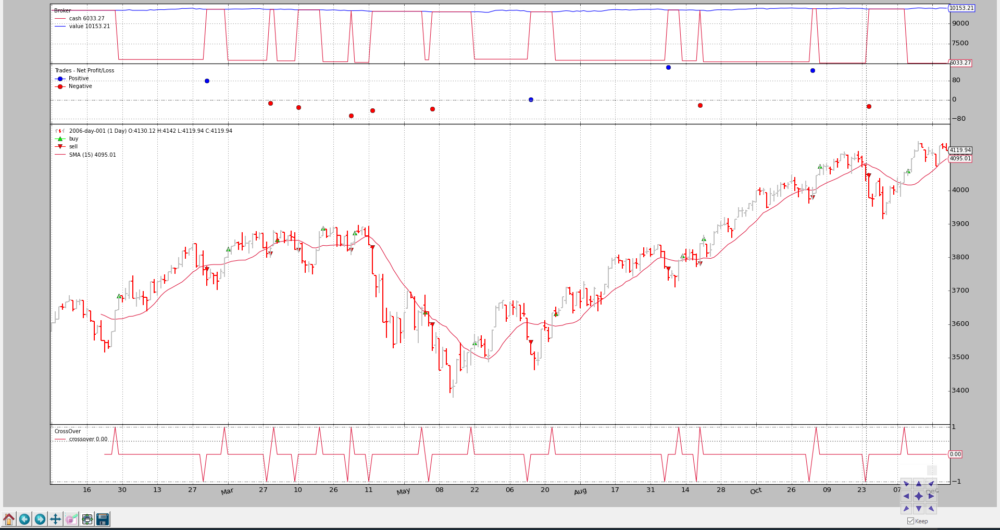
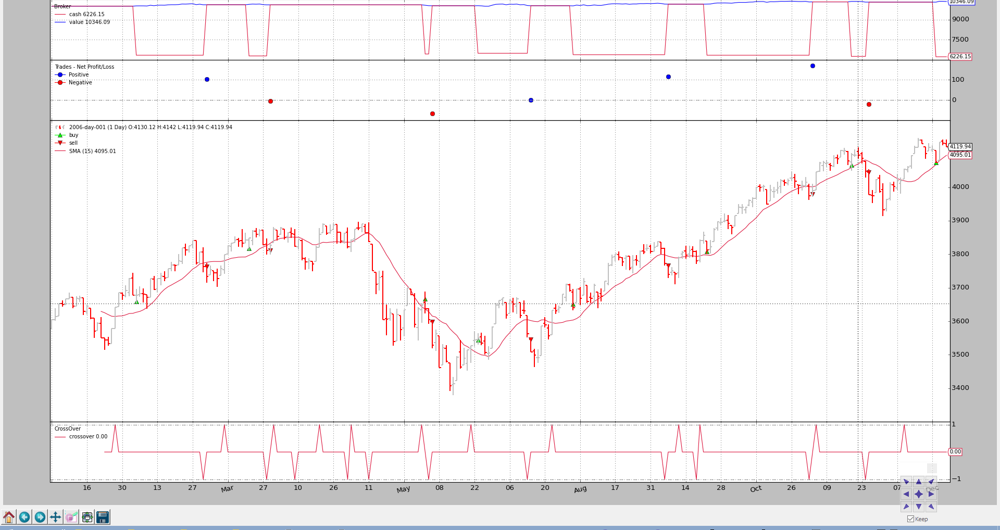

- [Order Management and Execution](#order-management-and-execution)
- [Order Management](#order-management)
- [Order Execution Logic](#order-execution-logic)
  - [Market](#market)
  - [Close](#close)
  - [Limit](#limit)
  - [Stop](#stop)
  - [StopLimit](#stoplimit)
- [Some samples](#some-samples)
  - [Execution Type: Market](#execution-type-market)
  - [Execution Type: Close](#execution-type-close)
  - [Execution Type: Limit](#execution-type-limit)
  - [Execution Type: Limit with validity](#execution-type-limit-with-validity)
  - [Execution Type: Stop](#execution-type-stop)
  - [Execution Type: StopLimit](#execution-type-stoplimit)
  - [Test Script Execution](#test-script-execution)
  - [The full code](#the-full-code)

-------------------------------------------------------
# Order Management and Execution
backtrader如果无法模拟订单，则回测将因此不完整。为此，平台中提供了以下内容。

订单管理有3个基本点:
* buy
* sell
* cancel
> update 原语显然是一种逻辑，但根据常识，这种方法主要由手动操作人员使用, 判断交易方法。

对于订单执行逻辑，以下执行类型：
* Market
* Close
* Limit
* Stop
* StopLimit

# Order Management
一些例子:
```
# buy the main date, with sizer default stake, Market order
order = self.buy()

# Market order - valid will be "IGNORED"
order = self.buy(valid=datetime.datetime.now() + datetime.timedelta(days=3))

# Market order - price will be IGNORED
order = self.buy(price=self.data.close[0] * 1.02)

# Market order - manual stake
order = self.buy(size=25)

# Limit order - want to set the price and can set a validity
order = self.buy(exectype=Order.Limit,
                 price=self.data.close[0] * 1.02,
                 valid=datetime.datetime.now() + datetime.timedelta(days=3)))

# StopLimit order - want to set the price, price limit
order = self.buy(exectype=Order.StopLimit,
                 price=self.data.close[0] * 1.02,
                 plimit=self.data.close[0] * 1.07)

# Canceling an existing order
self.broker.cancel(order)
```
所有的订单类型都可以通过创建一个订单实例(或者它的子类之一)来创建，然后通过以下方式传递给代理:
```
order = self.broker.submit(order)
```
> broker本身有buy和sell原语，但是就默认参数而言，它们并不那么灵活。


# Order Execution Logic
该broker订单执行使用2个主要的准则（假设？）。

* 当前数据已经发生，不能用于执行订单。如果策略中的逻辑类似于：
    ```
    if self.data.close > self.sma:  # where sma is a Simple Moving Average
        self.buy()
    ```
    预期的动作不能以close逻辑上正在检查的价格执行订单 ，因为它已经发生。

    订单可以 首先被 EXECUTED 在下一组 Open/High/Low/Close 的边界价格点（条件由 order 发出）

* volume 不起作用
    
    实际上，如果交易者选择非流动资产，或者恰好触及了价格bar的极端（high/low），则它实际上在真实交易中起作用。

    但是很少会出现高点/低点的情况（如果您这样做…则不需要backtrader），并且所选资产将具有足够的流动性来吸收任何常规交易的订单


## Market
执行：
* 下一组开盘价/最高价/最低价/收盘价的开盘价（通常称为bar）

理由：
* 如果逻辑已在X点及时执行并发出了 `Market` 指令，那么下一个即将发生的价格点就是即将到来的 `open` 价格

> 这个 order 执行总是忽略任何用于创建它的 `price` 和 `valid` 参数

## Close
执行：
* 在下一个 bar CLOSES 时使用下一个柱的 close 价格

理由：
* 大多数回溯测试 feeds 含有已 closed bars, 同时将要立即在下一个bar的close价格执行的订单。每日 data feed 是最常见的示例。

    但是系统可能会收到“tick”价格，并且实际的 bar（时间/日期）将不断更新以新的 tick 报价，而无需实际移至下一个bar（因为时间 和/或 日期没更改）

    仅当时间或日期更改时，bar 才真正关闭并且订单被执行

## Limit
执行:
* 如果 data 触及 Limit, 在 order 创建期设置的 price, 在下一个价格 bar 开始. 如果设置了 `valid`, 然后时间到了, 该订单将被取消.

价格匹配:
* backtrader 尝试提供最真实的 `Limit` 订单执行价格    
    使用4个价格(Open/High/Low/Close), 可以部分推断出请求 price 是否可以改善。

    对于 Buy 订单
    * Case 1:   
        如果bar的 `open` 价低于 `limit` 价, 那么立即用 `open` 价执行. 在 `session` 开始阶段就已经扫掉了

    * Case 2:   
        如果 `open` 价没有 `limit` 价低, 但是 `low` 价比 `limit` 低, 那么在 session 阶段还是可以看到 `limit` 价格, 订单可以被执行
    
    在 `Sell` 订单中逻辑相反

## Stop
执行:
* 如果 data 触及 Stop, order 创建期设置的触发价格, 在下一个价格 bar 开始. 如果设置了 valid, 然后时间到了, 该订单将被取消.

价格匹配:
* backtrader 尝试提供最真实的 Stop 订单执行价格        
    使用4个价格(Open/High/Low/Close), 可以部分推断出请求 price 是否可以改善。

    对于 `Buy` 订单:
    * Case 1:   
        如果 bar 的 `open` 价高于 `stop` 价, 那么立即用 `open` 价执行. 如果价格上升, 手上持有空单, 这种情况可以 stop 损失
    
    * Case 2:       
        如果 `open` 价没有在 `stop` 价之上, 但是 `high` 价在 `stop` 之上, 那么 `stop` 价可以在 session 期间被看到, 订单可以被执行
    
    在 `Sell` 订单中逻辑相反

## StopLimit
执行:
* 从下一个价格 bar 开始时设置触发价格 order。

价格匹配：

* 触发：使用 `Stop` 匹配逻辑（但仅触发并将订单转换为 `Limit` 订单）

* `Limit`：使用 `Limit` 价格的匹配逻辑


# Some samples
与往常一样，图片（带代码）值得进行数百万篇长的解释。请注意，摘要集中在订单创建部分。完整的代码在底部。

一个 price 关闭在 以上/以下 简单移动平均线策略将用于买入/卖出信号的生成

该信号在图表底部：`CrossOver` 使用交叉指示器。

系统将保留对生成的“购买”订单的引用，最多只允许一个即时订单。

## Execution Type: Market
在图表中查看如何在开盘价产生信号后在一个bar上执行订单。
```
            if self.p.exectype == 'Market':
                self.buy(exectype=bt.Order.Market)  # default if not given

                self.log('BUY CREATE, exectype Market, price %.2f' %
                            self.data.close[0])
```



命令行输出:
```
$ ./order-execution-samples.py --exectype Market
2006-01-26T23:59:59+00:00, BUY CREATE, exectype Market, price 3641.42
2006-01-26T23:59:59+00:00, ORDER ACCEPTED/SUBMITTED
2006-01-27T23:59:59+00:00, BUY EXECUTED, Price: 3643.35, Cost: 3643.35, Comm 0.00
2006-03-02T23:59:59+00:00, SELL CREATE, 3763.73
2006-03-02T23:59:59+00:00, ORDER ACCEPTED/SUBMITTED
2006-03-03T23:59:59+00:00, SELL EXECUTED, Price: 3763.95, Cost: 3763.95, Comm 0.00
...
...
2006-12-11T23:59:59+00:00, BUY CREATE, exectype Market, price 4052.89
2006-12-11T23:59:59+00:00, ORDER ACCEPTED/SUBMITTED
2006-12-12T23:59:59+00:00, BUY EXECUTED, Price: 4052.55, Cost: 4052.55, Comm 0.00
```

## Execution Type: Close
现在订单还是在1个bar上执行, 但是使用收盘价
```
            elif self.p.exectype == 'Close':
                self.buy(exectype=bt.Order.Close)

                self.log('BUY CREATE, exectype Close, price %.2f' %
                         self.data.close[0])
```



命令行输入:
```
$ ./order-execution-samples.py --exectype Close
2006-01-26T23:59:59+00:00, BUY CREATE, exectype Close, price 3641.42
2006-01-26T23:59:59+00:00, ORDER ACCEPTED/SUBMITTED
2006-01-27T23:59:59+00:00, BUY EXECUTED, Price: 3685.48, Cost: 3685.48, Comm 0.00
2006-03-02T23:59:59+00:00, SELL CREATE, 3763.73
2006-03-02T23:59:59+00:00, ORDER ACCEPTED/SUBMITTED
2006-03-03T23:59:59+00:00, SELL EXECUTED, Price: 3763.95, Cost: 3763.95, Comm 0.00
...
...
2006-11-06T23:59:59+00:00, BUY CREATE, exectype Close, price 4045.22
2006-11-06T23:59:59+00:00, ORDER ACCEPTED/SUBMITTED
2006-11-07T23:59:59+00:00, BUY EXECUTED, Price: 4072.86, Cost: 4072.86, Comm 0.00
2006-11-24T23:59:59+00:00, SELL CREATE, 4048.16
2006-11-24T23:59:59+00:00, ORDER ACCEPTED/SUBMITTED
2006-11-27T23:59:59+00:00, SELL EXECUTED, Price: 4045.05, Cost: 4045.05, Comm 0.00
2006-12-11T23:59:59+00:00, BUY CREATE, exectype Close, price 4052.89
2006-12-11T23:59:59+00:00, ORDER ACCEPTED/SUBMITTED
2006-12-12T23:59:59+00:00, BUY EXECUTED, Price: 4059.74, Cost: 4059.74, Comm 0.00
```

## Execution Type: Limit
在一些操作前, 进行有效期计算:
```
            if self.p.valid:
                valid = self.data.datetime.date(0) + \
                        datetime.timedelta(days=self.p.valid)
            else:
                valid = None
```
设置一个 Limit 价在生成的信号(信号bar的close)下 1% 处. 注意，这是如何阻止上面的许多订单被执行的。
```
            elif self.p.exectype == 'Limit':
                price = self.data.close * (1.0 - self.p.perc1 / 100.0)

                self.buy(exectype=bt.Order.Limit, price=price, valid=valid)

                if self.p.valid:
                    txt = 'BUY CREATE, exectype Limit, price %.2f, valid: %s'
                    self.log(txt % (price, valid.strftime('%Y-%m-%d')))
                else:
                    txt = 'BUY CREATE, exectype Limit, price %.2f'
                    self.log(txt % price)
```


只有4个orders被分发出去了. 限制价格试图抓住小幅下跌，已经完全改变了输出。

命令行输出:
```
$ ./order-execution-samples.py --exectype Limit --perc1 1
2006-01-26T23:59:59+00:00, BUY CREATE, exectype Limit, price 3605.01
2006-01-26T23:59:59+00:00, ORDER ACCEPTED/SUBMITTED
2006-05-18T23:59:59+00:00, BUY EXECUTED, Price: 3605.01, Cost: 3605.01, Comm 0.00
2006-06-05T23:59:59+00:00, SELL CREATE, 3604.33
2006-06-05T23:59:59+00:00, ORDER ACCEPTED/SUBMITTED
2006-06-06T23:59:59+00:00, SELL EXECUTED, Price: 3598.58, Cost: 3598.58, Comm 0.00
2006-06-21T23:59:59+00:00, BUY CREATE, exectype Limit, price 3491.57
2006-06-21T23:59:59+00:00, ORDER ACCEPTED/SUBMITTED
2006-06-28T23:59:59+00:00, BUY EXECUTED, Price: 3491.57, Cost: 3491.57, Comm 0.00
2006-07-13T23:59:59+00:00, SELL CREATE, 3562.56
2006-07-13T23:59:59+00:00, ORDER ACCEPTED/SUBMITTED
2006-07-14T23:59:59+00:00, SELL EXECUTED, Price: 3545.92, Cost: 3545.92, Comm 0.00
2006-07-24T23:59:59+00:00, BUY CREATE, exectype Limit, price 3596.60
2006-07-24T23:59:59+00:00, ORDER ACCEPTED/SUBMITTED
```

## Execution Type: Limit with validity
为了不一直等待限价单，该限价单只能在价格朝“买进”定单移动时执行，该定单将仅有效4天（日历）。


生成了更多的订单，但除一个“购买”订单外，其他所有订单均已过期，进一步限制了操作量。

命令行和输出：
```
$ ./order-execution-samples.py --exectype Limit --perc1 1 --valid 4
2006-01-26T23:59:59+00:00, BUY CREATE, exectype Limit, price 3605.01, valid: 2006-01-30
2006-01-26T23:59:59+00:00, ORDER ACCEPTED/SUBMITTED
2006-01-30T23:59:59+00:00, BUY EXPIRED
2006-03-10T23:59:59+00:00, BUY CREATE, exectype Limit, price 3760.48, valid: 2006-03-14
2006-03-10T23:59:59+00:00, ORDER ACCEPTED/SUBMITTED
2006-03-14T23:59:59+00:00, BUY EXPIRED
2006-03-30T23:59:59+00:00, BUY CREATE, exectype Limit, price 3835.86, valid: 2006-04-03
2006-03-30T23:59:59+00:00, ORDER ACCEPTED/SUBMITTED
2006-04-03T23:59:59+00:00, BUY EXPIRED
2006-04-20T23:59:59+00:00, BUY CREATE, exectype Limit, price 3821.40, valid: 2006-04-24
2006-04-20T23:59:59+00:00, ORDER ACCEPTED/SUBMITTED
2006-04-24T23:59:59+00:00, BUY EXPIRED
2006-05-04T23:59:59+00:00, BUY CREATE, exectype Limit, price 3804.65, valid: 2006-05-08
2006-05-04T23:59:59+00:00, ORDER ACCEPTED/SUBMITTED
2006-05-08T23:59:59+00:00, BUY EXPIRED
2006-06-01T23:59:59+00:00, BUY CREATE, exectype Limit, price 3611.85, valid: 2006-06-05
2006-06-01T23:59:59+00:00, ORDER ACCEPTED/SUBMITTED
2006-06-05T23:59:59+00:00, BUY EXPIRED
2006-06-21T23:59:59+00:00, BUY CREATE, exectype Limit, price 3491.57, valid: 2006-06-25
2006-06-21T23:59:59+00:00, ORDER ACCEPTED/SUBMITTED
2006-06-26T23:59:59+00:00, BUY EXPIRED
2006-07-24T23:59:59+00:00, BUY CREATE, exectype Limit, price 3596.60, valid: 2006-07-28
2006-07-24T23:59:59+00:00, ORDER ACCEPTED/SUBMITTED
2006-07-28T23:59:59+00:00, BUY EXPIRED
2006-09-12T23:59:59+00:00, BUY CREATE, exectype Limit, price 3751.07, valid: 2006-09-16
2006-09-12T23:59:59+00:00, ORDER ACCEPTED/SUBMITTED
2006-09-18T23:59:59+00:00, BUY EXPIRED
2006-09-20T23:59:59+00:00, BUY CREATE, exectype Limit, price 3802.90, valid: 2006-09-24
2006-09-20T23:59:59+00:00, ORDER ACCEPTED/SUBMITTED
2006-09-22T23:59:59+00:00, BUY EXECUTED, Price: 3802.90, Cost: 3802.90, Comm 0.00
2006-11-02T23:59:59+00:00, SELL CREATE, 3974.62
2006-11-02T23:59:59+00:00, ORDER ACCEPTED/SUBMITTED
2006-11-03T23:59:59+00:00, SELL EXECUTED, Price: 3979.73, Cost: 3979.73, Comm 0.00
2006-11-06T23:59:59+00:00, BUY CREATE, exectype Limit, price 4004.77, valid: 2006-11-10
2006-11-06T23:59:59+00:00, ORDER ACCEPTED/SUBMITTED
2006-11-10T23:59:59+00:00, BUY EXPIRED
2006-12-11T23:59:59+00:00, BUY CREATE, exectype Limit, price 4012.36, valid: 2006-12-15
2006-12-11T23:59:59+00:00, ORDER ACCEPTED/SUBMITTED
2006-12-15T23:59:59+00:00, BUY EXPIRED
```

## Execution Type: Stop
设置高于信号价格 1% 的止损价。这意味着该策略仅在信号产生且价格继续攀升时才买入，这可能会被解读为强势信号。

这完全改变了执行全貌。
```
            elif self.p.exectype == 'Stop':
                price = self.data.close * (1.0 + self.p.perc1 / 100.0)

                self.buy(exectype=bt.Order.Stop, price=price, valid=valid)

                if self.p.valid:
                    txt = 'BUY CREATE, exectype Stop, price %.2f, valid: %s'
                    self.log(txt % (price, valid.strftime('%Y-%m-%d')))
                else:
                    txt = 'BUY CREATE, exectype Stop, price %.2f'
                    self.log(txt % price)
```


命令行输出:
```
$ ./order-execution-samples.py --exectype Stop --perc1 1
2006-01-26T23:59:59+00:00, BUY CREATE, exectype Stop, price 3677.83
2006-01-26T23:59:59+00:00, ORDER ACCEPTED/SUBMITTED
2006-01-27T23:59:59+00:00, BUY EXECUTED, Price: 3677.83, Cost: 3677.83, Comm 0.00
2006-03-02T23:59:59+00:00, SELL CREATE, 3763.73
2006-03-02T23:59:59+00:00, ORDER ACCEPTED/SUBMITTED
2006-03-03T23:59:59+00:00, SELL EXECUTED, Price: 3763.95, Cost: 3763.95, Comm 0.00
2006-03-10T23:59:59+00:00, BUY CREATE, exectype Stop, price 3836.44
2006-03-10T23:59:59+00:00, ORDER ACCEPTED/SUBMITTED
2006-03-15T23:59:59+00:00, BUY EXECUTED, Price: 3836.44, Cost: 3836.44, Comm 0.00
2006-03-28T23:59:59+00:00, SELL CREATE, 3811.45
2006-03-28T23:59:59+00:00, ORDER ACCEPTED/SUBMITTED
2006-03-29T23:59:59+00:00, SELL EXECUTED, Price: 3811.85, Cost: 3811.85, Comm 0.00
2006-03-30T23:59:59+00:00, BUY CREATE, exectype Stop, price 3913.36
2006-03-30T23:59:59+00:00, ORDER ACCEPTED/SUBMITTED
2006-09-29T23:59:59+00:00, BUY EXECUTED, Price: 3913.36, Cost: 3913.36, Comm 0.00
2006-11-02T23:59:59+00:00, SELL CREATE, 3974.62
2006-11-02T23:59:59+00:00, ORDER ACCEPTED/SUBMITTED
2006-11-03T23:59:59+00:00, SELL EXECUTED, Price: 3979.73, Cost: 3979.73, Comm 0.00
2006-11-06T23:59:59+00:00, BUY CREATE, exectype Stop, price 4085.67
2006-11-06T23:59:59+00:00, ORDER ACCEPTED/SUBMITTED
2006-11-13T23:59:59+00:00, BUY EXECUTED, Price: 4085.67, Cost: 4085.67, Comm 0.00
2006-11-24T23:59:59+00:00, SELL CREATE, 4048.16
2006-11-24T23:59:59+00:00, ORDER ACCEPTED/SUBMITTED
2006-11-27T23:59:59+00:00, SELL EXECUTED, Price: 4045.05, Cost: 4045.05, Comm 0.00
2006-12-11T23:59:59+00:00, BUY CREATE, exectype Stop, price 4093.42
2006-12-11T23:59:59+00:00, ORDER ACCEPTED/SUBMITTED
2006-12-13T23:59:59+00:00, BUY EXECUTED, Price: 4093.42, Cost: 4093.42, Comm 0.00
```

## Execution Type: StopLimit
设置高于信号价格1%的止损价。但是将 limit 价格设定为高于信号（收盘价）价格的 0.5%, 可以将其解释为：等待趋势，但不买入峰值。等待dip。

有效期上限为20天（日历）
```
            elif self.p.exectype == 'StopLimit':
                price = self.data.close * (1.0 + self.p.perc1 / 100.0)

                plimit = self.data.close * (1.0 + self.p.perc2 / 100.0)

                self.buy(exectype=bt.Order.StopLimit, price=price, valid=valid,
                         plimit=plimit)

                if self.p.valid:
                    txt = ('BUY CREATE, exectype StopLimit, price %.2f,'
                           ' valid: %s, pricelimit: %.2f')
                    self.log(txt % (price, valid.strftime('%Y-%m-%d'), plimit))
                else:
                    txt = ('BUY CREATE, exectype StopLimit, price %.2f,'
                           ' pricelimit: %.2f')
                    self.log(txt % (price, plimit))
```



命令行输出如下:
```
$ ./order-execution-samples.py --exectype StopLimit --perc1 1 --perc2 0.5 --valid 20
2006-01-26T23:59:59+00:00, BUY CREATE, exectype StopLimit, price 3677.83, valid: 2006-02-15, pricelimit: 3659.63
2006-01-26T23:59:59+00:00, ORDER ACCEPTED/SUBMITTED
2006-02-03T23:59:59+00:00, BUY EXECUTED, Price: 3659.63, Cost: 3659.63, Comm 0.00
2006-03-02T23:59:59+00:00, SELL CREATE, 3763.73
2006-03-02T23:59:59+00:00, ORDER ACCEPTED/SUBMITTED
2006-03-03T23:59:59+00:00, SELL EXECUTED, Price: 3763.95, Cost: 3763.95, Comm 0.00
2006-03-10T23:59:59+00:00, BUY CREATE, exectype StopLimit, price 3836.44, valid: 2006-03-30, pricelimit: 3817.45
2006-03-10T23:59:59+00:00, ORDER ACCEPTED/SUBMITTED
2006-03-21T23:59:59+00:00, BUY EXECUTED, Price: 3817.45, Cost: 3817.45, Comm 0.00
2006-03-28T23:59:59+00:00, SELL CREATE, 3811.45
2006-03-28T23:59:59+00:00, ORDER ACCEPTED/SUBMITTED
2006-03-29T23:59:59+00:00, SELL EXECUTED, Price: 3811.85, Cost: 3811.85, Comm 0.00
2006-03-30T23:59:59+00:00, BUY CREATE, exectype StopLimit, price 3913.36, valid: 2006-04-19, pricelimit: 3893.98
2006-03-30T23:59:59+00:00, ORDER ACCEPTED/SUBMITTED
2006-04-19T23:59:59+00:00, BUY EXPIRED
...
...
2006-12-11T23:59:59+00:00, BUY CREATE, exectype StopLimit, price 4093.42, valid: 2006-12-31, pricelimit: 4073.15
2006-12-11T23:59:59+00:00, ORDER ACCEPTED/SUBMITTED
2006-12-22T23:59:59+00:00, BUY EXECUTED, Price: 4073.15, Cost: 4073.15, Comm 0.00
```

## Test Script Execution
```
$ ./order-execution-samples.py --help
usage: order-execution-samples.py [-h] [--infile INFILE]
                                  [--csvformat {bt,visualchart,sierrachart,yahoo,yahoo_unreversed}]
                                  [--fromdate FROMDATE] [--todate TODATE]
                                  [--plot] [--plotstyle {bar,line,candle}]
                                  [--numfigs NUMFIGS] [--smaperiod SMAPERIOD]
                                  [--exectype EXECTYPE] [--valid VALID]
                                  [--perc1 PERC1] [--perc2 PERC2]

Showcase for Order Execution Types

optional arguments:
  -h, --help            show this help message and exit
  --infile INFILE, -i INFILE
                        File to be read in
  --csvformat {bt,visualchart,sierrachart,yahoo,yahoo_unreversed},
  -c {bt,visualchart,sierrachart,yahoo,yahoo_unreversed}
                        CSV Format
  --fromdate FROMDATE, -f FROMDATE
                        Starting date in YYYY-MM-DD format
  --todate TODATE, -t TODATE
                        Ending date in YYYY-MM-DD format
  --plot, -p            Plot the read data
  --plotstyle {bar,line,candle}, -ps {bar,line,candle}
                        Plot the read data
  --numfigs NUMFIGS, -n NUMFIGS
                        Plot using n figures
  --smaperiod SMAPERIOD, -s SMAPERIOD
                      Simple Moving Average Period
  --exectype EXECTYPE, -e EXECTYPE
                        Execution Type: Market (default), Close, Limit,
                        Stop, StopLimit
  --valid VALID, -v VALID
                        Validity for Limit sample: default 0 days
  --perc1 PERC1, -p1 PERC1
                        % distance from close price at order creation time for
                        the limit/trigger price in Limit/Stop orders
  --perc2 PERC2, -p2 PERC2
                        % distance from close price at order creation time for
                        the limit price in StopLimit orders
```

## The full code
```
from __future__ import (absolute_import, division, print_function,
                        unicode_literals)

import argparse
import datetime
import os.path
import time
import sys


import backtrader as bt
import backtrader.feeds as btfeeds
import backtrader.indicators as btind


class OrderExecutionStrategy(bt.Strategy):
    params = (
        ('smaperiod', 15),
        ('exectype', 'Market'),
        ('perc1', 3),
        ('perc2', 1),
        ('valid', 4),
    )

    def log(self, txt, dt=None):
        ''' Logging function fot this strategy'''
        dt = dt or self.data.datetime[0]
        if isinstance(dt, float):
            dt = bt.num2date(dt)
        print('%s, %s' % (dt.isoformat(), txt))

    def notify_order(self, order):
        if order.status in [order.Submitted, order.Accepted]:
            # Buy/Sell order submitted/accepted to/by broker - Nothing to do
            self.log('ORDER ACCEPTED/SUBMITTED', dt=order.created.dt)
            self.order = order
            return

        if order.status in [order.Expired]:
            self.log('BUY EXPIRED')

        elif order.status in [order.Completed]:
            if order.isbuy():
                self.log(
                    'BUY EXECUTED, Price: %.2f, Cost: %.2f, Comm %.2f' %
                    (order.executed.price,
                     order.executed.value,
                     order.executed.comm))

            else:  # Sell
                self.log('SELL EXECUTED, Price: %.2f, Cost: %.2f, Comm %.2f' %
                         (order.executed.price,
                          order.executed.value,
                          order.executed.comm))

        # Sentinel to None: new orders allowed
        self.order = None

    def __init__(self):
        # SimpleMovingAverage on main data
        # Equivalent to -> sma = btind.SMA(self.data, period=self.p.smaperiod)
        sma = btind.SMA(period=self.p.smaperiod)

        # CrossOver (1: up, -1: down) close / sma
        self.buysell = btind.CrossOver(self.data.close, sma, plot=True)

        # Sentinel to None: new ordersa allowed
        self.order = None

    def next(self):
        if self.order:
            # An order is pending ... nothing can be done
            return

        # Check if we are in the market
        if self.position:
            # In the maerket - check if it's the time to sell
            if self.buysell < 0:
                self.log('SELL CREATE, %.2f' % self.data.close[0])
                self.sell()

        elif self.buysell > 0:
            if self.p.valid:
                valid = self.data.datetime.date(0) + \
                        datetime.timedelta(days=self.p.valid)
            else:
                valid = None

            # Not in the market and signal to buy
            if self.p.exectype == 'Market':
                self.buy(exectype=bt.Order.Market)  # default if not given

                self.log('BUY CREATE, exectype Market, price %.2f' %
                         self.data.close[0])

            elif self.p.exectype == 'Close':
                self.buy(exectype=bt.Order.Close)

                self.log('BUY CREATE, exectype Close, price %.2f' %
                         self.data.close[0])

            elif self.p.exectype == 'Limit':
                price = self.data.close * (1.0 - self.p.perc1 / 100.0)

                self.buy(exectype=bt.Order.Limit, price=price, valid=valid)

                if self.p.valid:
                    txt = 'BUY CREATE, exectype Limit, price %.2f, valid: %s'
                    self.log(txt % (price, valid.strftime('%Y-%m-%d')))
                else:
                    txt = 'BUY CREATE, exectype Limit, price %.2f'
                    self.log(txt % price)

            elif self.p.exectype == 'Stop':
                price = self.data.close * (1.0 + self.p.perc1 / 100.0)

                self.buy(exectype=bt.Order.Stop, price=price, valid=valid)

                if self.p.valid:
                    txt = 'BUY CREATE, exectype Stop, price %.2f, valid: %s'
                    self.log(txt % (price, valid.strftime('%Y-%m-%d')))
                else:
                    txt = 'BUY CREATE, exectype Stop, price %.2f'
                    self.log(txt % price)

            elif self.p.exectype == 'StopLimit':
                price = self.data.close * (1.0 + self.p.perc1 / 100.0)

                plimit = self.data.close * (1.0 + self.p.perc2 / 100.0)

                self.buy(exectype=bt.Order.StopLimit, price=price, valid=valid,
                         plimit=plimit)

                if self.p.valid:
                    txt = ('BUY CREATE, exectype StopLimit, price %.2f,'
                           ' valid: %s, pricelimit: %.2f')
                    self.log(txt % (price, valid.strftime('%Y-%m-%d'), plimit))
                else:
                    txt = ('BUY CREATE, exectype StopLimit, price %.2f,'
                           ' pricelimit: %.2f')
                    self.log(txt % (price, plimit))


def runstrat():
    args = parse_args()

    cerebro = bt.Cerebro()

    data = getdata(args)
    cerebro.adddata(data)

    cerebro.addstrategy(
        OrderExecutionStrategy,
        exectype=args.exectype,
        perc1=args.perc1,
        perc2=args.perc2,
        valid=args.valid,
        smaperiod=args.smaperiod
    )
    cerebro.run()

    if args.plot:
        cerebro.plot(numfigs=args.numfigs, style=args.plotstyle)


def getdata(args):

    dataformat = dict(
        bt=btfeeds.BacktraderCSVData,
        visualchart=btfeeds.VChartCSVData,
        sierrachart=btfeeds.SierraChartCSVData,
        yahoo=btfeeds.YahooFinanceCSVData,
        yahoo_unreversed=btfeeds.YahooFinanceCSVData
    )

    dfkwargs = dict()
    if args.csvformat == 'yahoo_unreversed':
        dfkwargs['reverse'] = True

    if args.fromdate:
        fromdate = datetime.datetime.strptime(args.fromdate, '%Y-%m-%d')
        dfkwargs['fromdate'] = fromdate

    if args.todate:
        fromdate = datetime.datetime.strptime(args.todate, '%Y-%m-%d')
        dfkwargs['todate'] = todate

    dfkwargs['dataname'] = args.infile

    dfcls = dataformat[args.csvformat]

    return dfcls(**dfkwargs)


def parse_args():
    parser = argparse.ArgumentParser(
        description='Showcase for Order Execution Types')

    parser.add_argument('--infile', '-i', required=False,
                        default='../../datas/2006-day-001.txt',
                        help='File to be read in')

    parser.add_argument('--csvformat', '-c', required=False, default='bt',
                        choices=['bt', 'visualchart', 'sierrachart',
                                 'yahoo', 'yahoo_unreversed'],
                        help='CSV Format')

    parser.add_argument('--fromdate', '-f', required=False, default=None,
                        help='Starting date in YYYY-MM-DD format')

    parser.add_argument('--todate', '-t', required=False, default=None,
                        help='Ending date in YYYY-MM-DD format')

    parser.add_argument('--plot', '-p', action='store_false', required=False,
                        help='Plot the read data')

    parser.add_argument('--plotstyle', '-ps', required=False, default='bar',
                        choices=['bar', 'line', 'candle'],
                        help='Plot the read data')

    parser.add_argument('--numfigs', '-n', required=False, default=1,
                        help='Plot using n figures')

    parser.add_argument('--smaperiod', '-s', required=False, default=15,
                        help='Simple Moving Average Period')

    parser.add_argument('--exectype', '-e', required=False, default='Market',
                        help=('Execution Type: Market (default), Close, Limit,'
                              ' Stop, StopLimit'))

    parser.add_argument('--valid', '-v', required=False, default=0, type=int,
                        help='Validity for Limit sample: default 0 days')

    parser.add_argument('--perc1', '-p1', required=False, default=0.0,
                        type=float,
                        help=('%% distance from close price at order creation'
                              ' time for the limit/trigger price in Limit/Stop'
                              ' orders'))

    parser.add_argument('--perc2', '-p2', required=False, default=0.0,
                        type=float,
                        help=('%% distance from close price at order creation'
                              ' time for the limit price in StopLimit orders'))

    return parser.parse_args()


if __name__ == '__main__':
    runstrat()
```