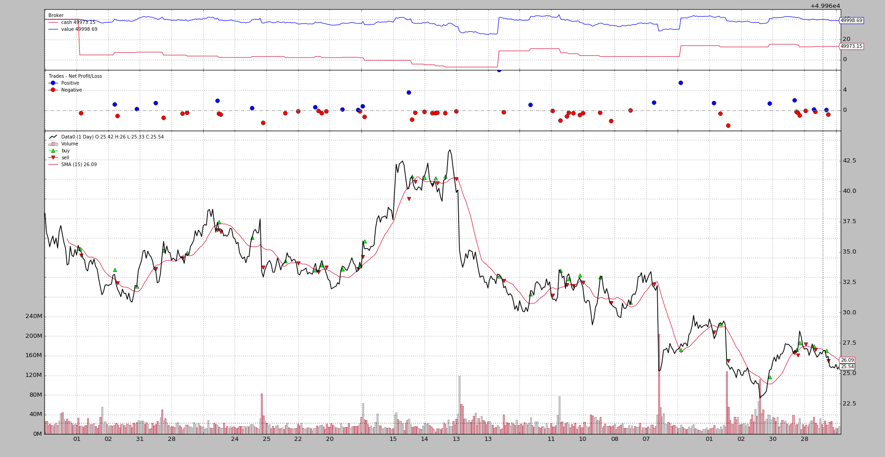

- [Sizers](#sizers)
  - [Using Sizers](#using-sizers)
    - [From Cerebro](#from-cerebro)
    - [From Strategy](#from-strategy)
  - [Sizer Development](#sizer-development)
  - [Practical Sizer Applicability](#practical-sizer-applicability)
- [Sizers - Reference](#sizers---reference)
----------------------------------------------
# Sizers
策略提供了交易的方法，即：`buy`, `sell`和`close`。让我们看看buy的签名：
```
def buy(self, data=None,
        size=None, price=None, plimit=None,
        exectype=None, valid=None, tradeid=0, **kwargs):
```
请注意，如果调用方未指定大小，则size的默认值为None。这就是Sizers发挥重要作用的地方：

* `size=None` , 策略向其Sizer请求实际的股份

这显然意味着策略里面有个 Sizer：是的，确实如此！。如果用户没有添加，则后台机制将默认的大小写器添加到策略中。添加到策略中的默认 `Sizer` 是 `SizerFix` 。定义的初始行：
```
class SizerFix(SizerBase):
    params = (('stake', 1),)
```
很容易猜测，这个规模的Sizer只是用1个单位的股份进行买卖（无论是股票、合约等）

## Using Sizers
### From Cerebro
通过 Cerebro 添加 Sizers 有两个不同的方法:

* addsizer(sizercls, *args, **kwargs)   
    添加一个Sizer，它将应用于添加到大脑的任何策略。可以说，这是默认的Sizer。例子：
    ```
    cerebro = bt.Cerebro()
    cerebro.addsizer(bt.sizers.SizerFix, stake=20)  # default sizer for strategies
    ```
* addsizer_byidx(idx, sizercls, *args, **kwargs)    
    Sizer只能通过策略返回的引用 idx 被添加  
    这个idx可以作为addstrategy的返回值获得。如：
    ```
    cerebro = bt.Cerebro()
    cerebro.addsizer(bt.sizers.SizerFix, stake=20)  # default sizer for strategies

    idx = cerebro.addstrategy(MyStrategy, myparam=myvalue)
    cerebro.addsizer_byidx(idx, bt.sizers.SizerFix, stake=5)

    cerebro.addstrategy(MyOtherStrategy)
    ```

    在这个例子中:
    * 系统中已添加了一个默认的Sizer, 这适用于所有没有指定特定 size 的策略。
    * 对于MyStrategy，在收集其插入 idx 之后，将添加一个特定的sizer（更改stake param）
    * 第二个策略，MyOtherStrategy，被添加到系统中。没有为它添加特定的Sizer
    * 这意味着:
        * MyStrategy 最终会有一个内部特定的 Sizer
        * MyOtherStrategy 将获得默认 Sizer

> 注意      
> 默认并不意味着这些策略共享一个Sizer实例。每个策略都会收到一个不同的默认sizer实例 ;  
> 要共享单个实例，要共享的sizer应该是一个singleton类（单例）。如何定义一个超出了backtrader的范围

### From Strategy
Strategy 类提供了一个API: `setsizer` 和 `getsizer` （以及一个属性 `sizer` ）来管理 Sizer。签名：

* `def setzer(self，sizer)`: 它需要一个已经实例化的 Sizer
* `def getsizer(self)`: 返回当前的 Sizer 实例
* `sizer` 它是可以直接 get/set 的属性

在这种情况下，Sizer可以是：
* 作为参数传递给策略
* 在 `__init__` 期间使用属性 `sizer` 或 `setsizer` 进行设置，如下所示：
    ```
    class MyStrategy(bt.Strategy):
    params = (('sizer', None),)

    def __init__(self):
        if self.p.sizer is not None:
            self.sizer = self.p.sizer
    ```
    例如，这将在 cerebro 发生调用的同一时间级别, 创建一个Sizer，并将其作为参数传递给系统中的所有策略，从而有效地允许共享一个Sizer

## Sizer Development
这样做很容易：
1. 子类继承 `backtrader.Sizer`
    这样你就可以访问 `self.strategy` 和 `self.broker`, 尽管大多数情况下你并不需要. 可以通过 broker 访问的如下:
    
    * `self.strategy.getposition(data)`, 获得 data 的 position

    * `self.broker.getvalue()`, 完整的 portfolio value  
        当然, 也可通过 `self.strategy.broker.getvalue()` 获取

2. 重构 `_getsizing(self, comminfo, cash, data, isbuy)`
    * `comminfo`：包含数据佣金信息的 `CommissionInfo` 实例，允许计算 position value、操作成本、操作佣金
    * `cash`: 当前 broker 可用的现金
    * `data`: 操作的目标
    * `isbuy`：对于 `buy` 操作为 `True`，对于 `sell` 操作为 `False`

        此方法返回 buy/sell 操作所需的 size

        返回的符号与此无关，即：如果操作是 sell 操作（isbuy将为False），则该方法可能返回 5 或 -5。只有绝对值将被sell操作使用。

        Sizer 已经去找 broker，请求提供给定数据的佣金信息、实际现金水平，并提供直接参考数据，这是操作的目标
    
    让我们定一个FixedSize:
    ```
    import backtrader as bt

    class FixedSize(bt.Sizer):
        params = (('stake', 1),)

        def _getsizing(self, comminfo, cash, data, isbuy):
            return self.params.stake
    ```
    这很简单，因为Sizer不进行计算，参数就在那里。
    
    但该机制应允许构建复杂的 sizing（又名 positioning）系统，以便在进入/退出市场时管理股权。

    另一个例子, position rerverser：
    ```
    class FixedRerverser(bt.FixedSize):

    def _getsizing(self, comminfo, cash, data, isbuy):
        position = self.broker.getposition(data)
        size = self.p.stake * (1 + (position.size != 0))
        return size
    ```
    它基于现有的 `FixedSize` 来继承参数，并重写 `_getsizing` ：
    * 通过 data 的属性 broker 来获取持仓情况
    * 使用 position.size 来计算是否需要两倍的量
    * 返回计算好的值

    这将减轻策略的负担，以决定是否必须逆转或打开头寸，Sizer是在控制之中的，可以随时替换而不影响逻辑。

## Practical Sizer Applicability
在不考虑复杂的 sizing 调整算法的情况下，可以使用两种不同的大小 sizers 来将策略从“仅多单”转换为“多空单”。通过简单地改变 cerebro 中的 Sizer，策略的行为也将改变。一种非常简单的收盘价交叉 SMA 算法：
```
class CloseSMA(bt.Strategy):
    params = (('period', 15),)

    def __init__(self):
        sma = bt.indicators.SMA(self.data, period=self.p.period)
        self.crossover = bt.indicators.CrossOver(self.data, sma)

    def next(self):
        if self.crossover > 0:
            self.buy()

        elif self.crossover < 0:
            self.sell()
```
注意策略是如何不在意当前仓位(通过查看 self.position)决定到底是买还是卖。只考虑来自交叉口的信号。所有的事都由 Sizers 负责。

如果已经开仓，则在卖出时，此sizer只负责返回非零 size：
```
class LongOnly(bt.Sizer):
    params = (('stake', 1),)

    def _getsizing(self, comminfo, cash, data, isbuy):
      if isbuy:
          return self.p.stake

      # Sell situation
      position = self.broker.getposition(data)
      if not position.size:
          return 0  # do not sell if nothing is open

      return self.p.stake
```
 把它们放在一起（假设backtrader已经导入，并且数据已经添加到系统中）：
```
...
cerebro.addstrategy(CloseSMA)
cerebro.addsizer(LongOnly)
...
cerebro.run()
...
```


Long-Short 版只需将 Sizer 更改为上面展示的 FixedReverser：
```
...
cerebro.addstrategy(CloseSMA)
cerebro.addsizer(FixedReverser)
...
cerebro.run()
...
```



注意区别：
* 交易数量重复了
* cash 水平永远不会回到 value，因为策略总是在市场上

这两种方法都是亏损的，但这只是一个例子。

------------------------------------
# [Sizers - Reference](./mkd02_Reference.md)