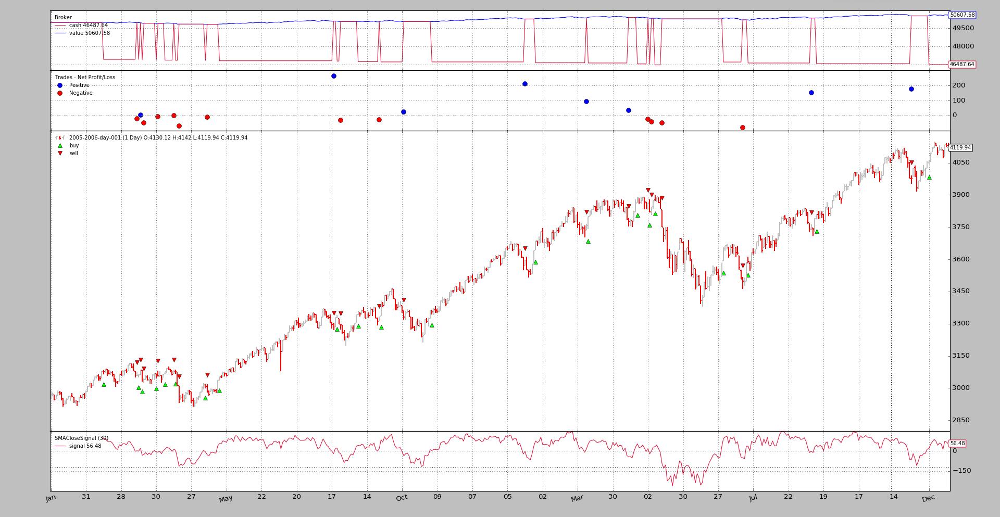

- [Strategy - Signals](#strategy---signals)
  - [Initial FAQ](#initial-faq)
  - [Signals technicalities](#signals-technicalities)
  - [Signals indications](#signals-indications)
  - [Signals Types](#signals-types)
  - [Accumulation and Order Concurrency](#accumulation-and-order-concurrency)
  - [The sample](#the-sample)
    - [First run: long and short](#first-run-long-and-short)
    - [Second run: long only](#second-run-long-only)
    - [Third run: short only](#third-run-short-only)
    - [Fourth run: long + longexit](#fourth-run-long--longexit)
    - [Usage](#usage)
    - [The code](#the-code)

---------------------------------------------------------
# Strategy - Signals
操作 backtrader 也可以不必编写 Strategy。尽管这是首选方法，但由于对象结构的构成机制，使用信号也是可能的。

快速概括:
* 代替编写一个策略类，实例化指标，编写买/卖逻辑…
* 最终用户添加信号(指标)，其余的在后台完成
```
import backtrader as bt

data = bt.feeds.OneOfTheFeeds(dataname='mydataname')
cerebro.adddata(data)

cerebro.add_signal(bt.SIGNAL_LONGSHORT, MySignal)
cerebro.run()
```
当然，信号本身已经消失了。让我们定义一个非常哑的信号，它会产生:
* 收盘价高于简单移动平均线 `Long` 
* 收盘价低于简单移动平均线 `Short`
```
class MySignal(bt.Indicator):
    lines = ('signal',)
    params = (('period', 30),)

    def __init__(self):
        self.lines.signal = self.data - bt.indicators.SMA(period=self.p.period)
```
现在它真的完成了。当运行执行时，Cerebro会实例化一个特殊的策略实例，该实例知道如何处理信号。

## Initial FAQ
* Q: 买卖操作的数量是如何确定的?    
  
  A: cerebro实例会自动向策略添加一个固定大小的sizer。最终用户可以用cerebro .addsizer来改变规格来改变策略

* Q: 订单是如何执行的?  
  
  A: 执行类型为市价单，有效期至取消

## Signals technicalities
从技术和理论的角度可以描述如下:
* 当调用一个可调用对象，返回另外一个对象(只有一次)  
    在大多数情况下，这是类的实例化，但并不必一定这样

* 支持 `__getitem__` 接口。唯一请求的 key/index 为0

从实际的角度来看，上面的例子一个信号是:
* `lines` 对象来自 backtrader 生态系统，主要是一个 `Indicator`  
    这有助于使用其他指标，如在示例中使用简单移动平均线。

## Signals indications
当使用 signal[0] 查询时，该信号给出 indicators，其意义为:
* `> 0` -> long indication
* `< 0` -> short indication
* `== 0` -> No indication

这个例子用self.data - SMA做了简单的算术
* 当数据高于 SMA 时，发出 `Long` indication
* 当数据低于 SMA 时, 发出 `Short` indication

> 当数据没有指定价格字段时，收盘价为参考价格。

## Signals Types
上例所示的常量，可以直接从主backtrader模块中获得，如下所示:
```
import backtrader as bt

bt.SIGNAL_LONG
```
有5种类型的信号，分为两组.

**Main Group**:
* `LONGSHORT`: 从信号中提取 `long` and `short` indications

* `LONG`:
    * `long` indications are taken to go long
    * `short` indications are taken to close the long position. But:

        * If a `LONGEXIT` (see below) signal is in the system it will be used to exit the long
        * If a `SHORT` signal is available and no `LONGEXIT` is available , it will be used to close a long before opening a short

* `SHORT`:
    * `short` indications are taken to go short
    * `long` indications are taken to close the short position. But:

        * If a `SHORTEXIT` (see below) signal is in the system it will be used to exit the short
        * If a `LONG` signal is available and no SHORTEXIT is available , it will be used to close a short before opening a long

**Exit Group**:
这两个信号是用来覆盖其他信号，并提供做多/做空的标准:
* `LONGEXIT`: short indications are taken to exit long positions
* `SHORTEXIT`: long indications are taken to exit short positions

## Accumulation and Order Concurrency
上面显示的样本信号将在一个常数的基础上发出多和空的指示，因为它只是简单地从收盘价减去SMA值，它将总是> 0和< 0(0在数学上是可能的，但不太可能真的发生)

这将导致订单的连续产生，从而产生两种情况:
* `Accumulation`: 即使已经持有订单，信号也会产生新的订单，从而增加在市场中的位置
* `Concurrency`: 在不等待其他订单执行的情况下生成新订单

为了避免这种情况，默认行为是:
* 不积累
* 不允许并发

如果你希望这两种行为中的任何一种，都可以通过cerebro来控制:
* `cerebro.signal_accumulate(True)` (or `False` to re-disable it)
* `cerebro.signal_concurrency(True)` (or `False` to re-disable it)

## The sample
backtrader 源包含一个测试功能的示例。

使用的主信号:
```
class SMACloseSignal(bt.Indicator):
    lines = ('signal',)
    params = (('period', 30),)

    def __init__(self):
        self.lines.signal = self.data - bt.indicators.SMA(period=self.p.period)
```
以及指定选项时的退出信号:
```
class SMAExitSignal(bt.Indicator):
    lines = ('signal',)
    params = (('p1', 5), ('p2', 30),)

    def __init__(self):
        sma1 = bt.indicators.SMA(period=self.p.p1)
        sma2 = bt.indicators.SMA(period=self.p.p2)
        self.lines.signal = sma1 - sma2
```

### First run: long and short
```
$ ./signals-strategy.py --plot --signal longshort
```


注意:
* 信号被绘制出来。这是正常的，因为它只是一个指标，并且适用于它的绘图规则
* 这种策略一直多单，空单。这可以看出，因为现金水平永远不会回到价值水平
* 附注: 即使是一个愚蠢的想法(并且没有佣金)，这个策略也不会赔钱……

### Second run: long only
```
$ ./signals-strategy.py --plot --signal longonly
```


注意:
* 在这里，现金水平回到每次出售后的价值水平，这意味着该策略已退出市场
* 旁注：没赔钱

### Third run: short only
```
$ ./signals-strategy.py --plot --signal shortonly
```


注意:
* 第一个预期的卖出操作，它发生的时间比上面两个示例中的第一个操作晚。直到收盘时低于SMA指数，简单的减法就会得到一个负数
* 在这里，每次买入后，现金水平回到价值水平，这意味着策略退出了市场
* 旁注：最后系统赔钱了
### Fourth run: long + longexit
```
$ ./signals-strategy.py --plot --signal longonly --exitsignal longexit
```


注意:
* 许多交易都是相同的，但有些交易中断得更早，因为出口信号中的快速移动平均线穿过缓慢移动平均线下行
* 该系统显示其长期属性，现金成为每笔交易结束时的价值
* 边注:即使是修改了一些交易，仍然可以赚钱
### Usage
```
$ ./signals-strategy.py --help
usage: signals-strategy.py [-h] [--data DATA] [--fromdate FROMDATE]
                           [--todate TODATE] [--cash CASH]
                           [--smaperiod SMAPERIOD] [--exitperiod EXITPERIOD]
                           [--signal {longshort,longonly,shortonly}]
                           [--exitsignal {longexit,shortexit}]
                           [--plot [kwargs]]

Sample for Signal concepts

optional arguments:
  -h, --help            show this help message and exit
  --data DATA           Specific data to be read in (default:
                        ../../datas/2005-2006-day-001.txt)
  --fromdate FROMDATE   Starting date in YYYY-MM-DD format (default: None)
  --todate TODATE       Ending date in YYYY-MM-DD format (default: None)
  --cash CASH           Cash to start with (default: 50000)
  --smaperiod SMAPERIOD
                        Period for the moving average (default: 30)
  --exitperiod EXITPERIOD
                        Period for the exit control SMA (default: 5)
  --signal {longshort,longonly,shortonly}
                        Signal type to use for the main signal (default:
                        longshort)
  --exitsignal {longexit,shortexit}
                        Signal type to use for the exit signal (default: None)
  --plot [kwargs], -p [kwargs]
                        Plot the read data applying any kwargs passed For
                        example: --plot style="candle" (to plot candles)
                        (default: None)
```
### The code
```
from __future__ import (absolute_import, division, print_function,
                        unicode_literals)

import argparse
import collections
import datetime

import backtrader as bt

MAINSIGNALS = collections.OrderedDict(
    (('longshort', bt.SIGNAL_LONGSHORT),
     ('longonly', bt.SIGNAL_LONG),
     ('shortonly', bt.SIGNAL_SHORT),)
)


EXITSIGNALS = {
    'longexit': bt.SIGNAL_LONGEXIT,
    'shortexit': bt.SIGNAL_LONGEXIT,
}


class SMACloseSignal(bt.Indicator):
    lines = ('signal',)
    params = (('period', 30),)

    def __init__(self):
        self.lines.signal = self.data - bt.indicators.SMA(period=self.p.period)


class SMAExitSignal(bt.Indicator):
    lines = ('signal',)
    params = (('p1', 5), ('p2', 30),)

    def __init__(self):
        sma1 = bt.indicators.SMA(period=self.p.p1)
        sma2 = bt.indicators.SMA(period=self.p.p2)
        self.lines.signal = sma1 - sma2


def runstrat(args=None):
    args = parse_args(args)

    cerebro = bt.Cerebro()
    cerebro.broker.set_cash(args.cash)

    dkwargs = dict()
    if args.fromdate is not None:
        fromdate = datetime.datetime.strptime(args.fromdate, '%Y-%m-%d')
        dkwargs['fromdate'] = fromdate

    if args.todate is not None:
        todate = datetime.datetime.strptime(args.todate, '%Y-%m-%d')
        dkwargs['todate'] = todate

    # if dataset is None, args.data has been given
    data = bt.feeds.BacktraderCSVData(dataname=args.data, **dkwargs)
    cerebro.adddata(data)

    cerebro.add_signal(MAINSIGNALS[args.signal],
                       SMACloseSignal, period=args.smaperiod)

    if args.exitsignal is not None:
        cerebro.add_signal(EXITSIGNALS[args.exitsignal],
                           SMAExitSignal,
                           p1=args.exitperiod,
                           p2=args.smaperiod)

    cerebro.run()
    if args.plot:
        pkwargs = dict(style='bar')
        if args.plot is not True:  # evals to True but is not True
            npkwargs = eval('dict(' + args.plot + ')')  # args were passed
            pkwargs.update(npkwargs)

        cerebro.plot(**pkwargs)


def parse_args(pargs=None):

    parser = argparse.ArgumentParser(
        formatter_class=argparse.ArgumentDefaultsHelpFormatter,
        description='Sample for Signal concepts')

    parser.add_argument('--data', required=False,
                        default='../../datas/2005-2006-day-001.txt',
                        help='Specific data to be read in')

    parser.add_argument('--fromdate', required=False, default=None,
                        help='Starting date in YYYY-MM-DD format')

    parser.add_argument('--todate', required=False, default=None,
                        help='Ending date in YYYY-MM-DD format')

    parser.add_argument('--cash', required=False, action='store',
                        type=float, default=50000,
                        help=('Cash to start with'))

    parser.add_argument('--smaperiod', required=False, action='store',
                        type=int, default=30,
                        help=('Period for the moving average'))

    parser.add_argument('--exitperiod', required=False, action='store',
                        type=int, default=5,
                        help=('Period for the exit control SMA'))

    parser.add_argument('--signal', required=False, action='store',
                        default=MAINSIGNALS.keys()[0], choices=MAINSIGNALS,
                        help=('Signal type to use for the main signal'))

    parser.add_argument('--exitsignal', required=False, action='store',
                        default=None, choices=EXITSIGNALS,
                        help=('Signal type to use for the exit signal'))

    # Plot options
    parser.add_argument('--plot', '-p', nargs='?', required=False,
                        metavar='kwargs', const=True,
                        help=('Plot the read data applying any kwargs passed\n'
                              '\n'
                              'For example:\n'
                              '\n'
                              '  --plot style="candle" (to plot candles)\n'))

    if pargs is not None:
        return parser.parse_args(pargs)

    return parser.parse_args()


if __name__ == '__main__':
    runstrat()
```